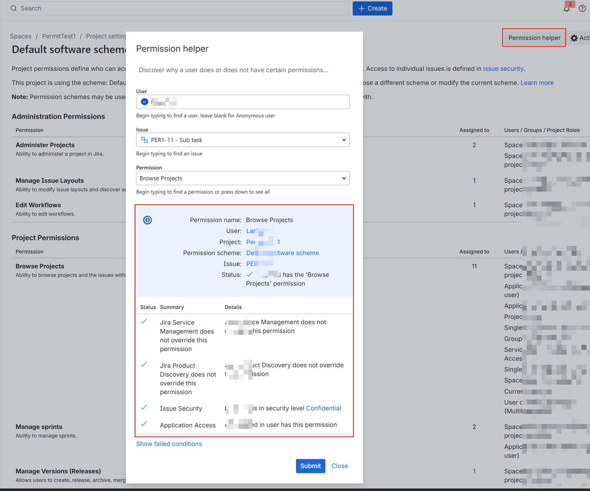

[[_TOC_]]

# Issue Indexed but Not Searchable Due to Permissions - Jira Cloud

Use this guide when an issue has been crawled and indexed, but the end user still cannot find it in Copilot or Microsoft Search, and Index Browser shows that access is denied.

This usually means the item exists in the index, but the effective ACL does not match the user's Jira permissions. Follow the steps in this document to troubleshoot and collect the information required for Microsoft support.

## Typical symptoms

- The issue exists in the connection and was crawled.
- The user can open the issue in Jira Cloud.
- Copilot does not return the issue.
- Index Browser shows `access denied` or shows that the expected permission is missing.

## Step-by-step checks

### Step 1. Confirm that the issue is present in the index

Open Index Browser and search for the exact issue ID.

Save a screenshot showing:

- The item was found by issue ID
- The access result for the affected user
- The permission information for the issue

### Step 2. Check what Jira indicates grants access to the affected user

Open the Jira project and navigate to:

1. `Project settings -> Permissions`
2. Click `Permission helper` in the upper-right corner.
3. Select the user who authenticated the connection.
4. Select an issue in the project.
5. Select `Browse Projects` and submit.
6. Save screenshots of the result.

Save screenshots showing:

- The user selected in Permission helper
- The permission result
- The group or project role used to grant access

### Step 3. Capture the project permission scheme

Open the project permission scheme and capture the entries related to viewing issues, especially those that determine whether the issue can be browsed.

Save screenshots showing:

- Permission scheme name
- Permission scheme ID, if visible
- The entries for browsing the project or viewing issues
- The group names and project roles shown in those entries

If the permission scheme ID is not visible in the UI, open:

`https://<your-jira-site>.atlassian.net/rest/api/2/project/<projectKey>/permissionscheme?expand=user`

Record:

- Permission scheme `id`
- The `BROWSE_PROJECTS` entries
- Any project role IDs or group names referenced there

### Step 4. If access is role-based, collect role details

If the permission helper shows that access is granted through a project role, collect the role ID.

Open:

`https://<your-jira-site>.atlassian.net/rest/api/3/project/<projectKey>/role`

Record the role URL and the numeric `roleId` at the end of that URL.

### Step 5. Compare Jira access with Index Browser access

Prepare a short written comparison:

- Jira Permission helper indicates access is granted by:
- Index Browser indicates access is:
- The expected matching group or role is:

This is often the fastest way to spot a mismatch.

## If the issue is not resolved, create a ticket and attach the following information

- Connection ID
- Affected user UPN or email
- Project ID:
`https://<your-jira-site>.atlassian.net/rest/api/3/project/<projectKey>`
- Issue ID:
`https://<your-jira-site>.atlassian.net/rest/api/3/issue/<issueKey>?fields=id,key,project`
- Permission scheme screenshot
`https://<your-jira-site>.atlassian.net/rest/api/2/project/<projectKey>/permissionscheme?expand=user`
- Permission helper screenshot
- Index Browser screenshot

## Suggested incident summary template

- Jira site URL:
- Connection ID:
- Affected user:
- Project key:
- Project ID:
- Issue key:
- Issue ID:
- Permission scheme ID:
- Role ID:
- Jira Permission helper indicates access is granted by:
- Index Browser indicates:
- Repro time in UTC:
- Attached screenshots:
