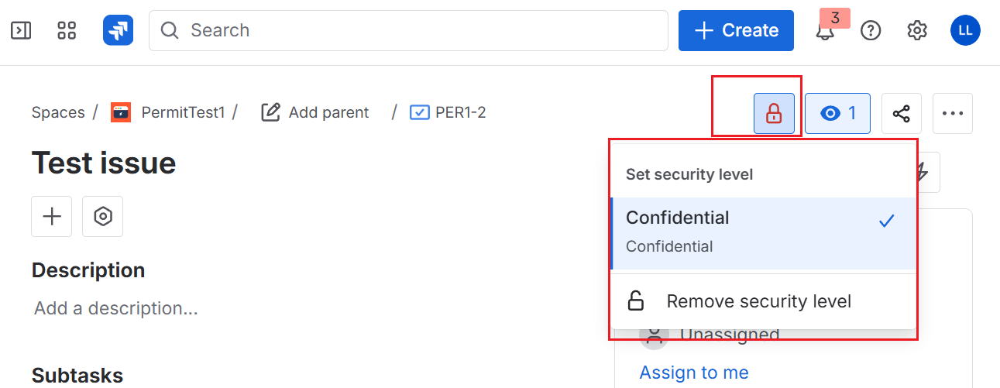
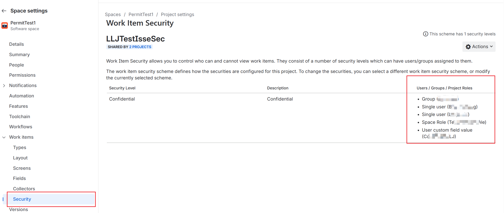

[[_TOC_]]

# Issue-Level Security Not Working - Jira Cloud

Use this guide when issue-level security configured in Jira Cloud is not enforced as expected in Microsoft Search, Copilot, or Index Browser.

Follow the steps in this document to troubleshoot the issue and collect the information required for Microsoft support.

## Typical symptoms

- The issue is visible in Jira only to a restricted set of users, but a broader set of users can still find it.
- The issue is visible in Jira to an authorized user, but Index Browser shows access denied.
- Two issues in the same project behave differently because they use different issue security levels.

## Important limitation

Scenarios that depend on a `Group custom field value` in the issue security configuration are currently not supported. Capture this configuration clearly so it can be identified early during triage.

## Step-by-step checks

### Step 1. Confirm that an issue security level is assigned

Open the issue in Jira and capture the issue details showing the assigned security level. This is typically shown on the issue page with a lock icon.

Record:

- The exact issue security level name assigned to the issue
- A screenshot of the issue details panel

### Step 2. Capture the issue security scheme used by the project

Open the Jira issue, click `Configure`, then click `Security`, and verify whether any work item security configuration is listed.

Save screenshots showing:

- The issue security scheme name
- The issue security levels configured in that scheme
- The members or rules associated with the affected level

### Step 3. Compare Jira security with Index Browser behavior

Open Index Browser for the exact issue and save:

- A screenshot showing the issue
- A screenshot showing whether access is granted or denied for the affected user

## If the issue is not resolved, contact Microsoft support and attach the following information

- Connection ID
- Project ID: `https://<your-jira-site>.atlassian.net/rest/api/3/project/<projectKey>`
- Issue ID: `https://<your-jira-site>.atlassian.net/rest/api/3/issue/<issueKey>?fields=id,key,project`
- Issue security scheme ID: `https://<your-jira-site>.atlassian.net/rest/api/2/project/<projectKey>/issuesecuritylevelscheme`
- If needed, issue security scheme members: `https://<your-jira-site>.atlassian.net/rest/api/2/issuesecurityschemes/<levelId>/members?startAt=0&maxResults=100`
- Screenshot of the issue security level name applied to the issue (typically shown with a lock icon on the issue page)
- Screenshot of the security configuration screen (`Configure` -> `Security`) showing whether work item security is listed

