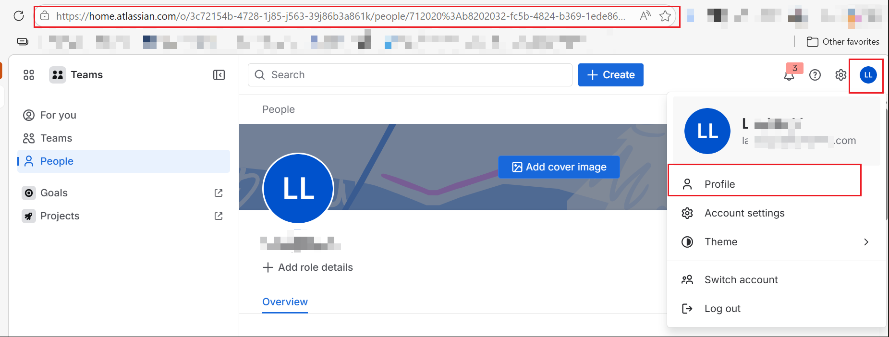

[[_TOC_]]

# Oversharing - Jira Cloud

Use this guide when a user can access Jira content in Copilot that they should not have access to.

There are two distinct scenarios, each of which must be handled separately.

Follow the steps below, record the required details and screenshots at each step, and contact Microsoft support with all collected information attached if the issue is not resolved.

## Scenario A. Index Browser shows access denied

This means the current indexed ACL already denies access, but Copilot may still return previously seen content from the user's working set or other cached experiences.

### Typical symptoms

- The user previously had access to the Jira issue.
- Access was recently removed in Jira.
- Index Browser now shows `access denied`.
- Copilot may still return the content, particularly if the user had searched for it before.

### What this means

If the issue content has not changed since the permission was removed, Copilot may still return content the user previously had access to. An integrity checker periodically revalidates access, typically every 14 days, and removes items the user no longer has permission to view. Additionally, if the item content changes after access is removed, the access check is triggered during the content update and the item may be removed sooner.

To validate whether this is a stale working-set effect:

1. Update the Jira issue content — for example, by editing the summary or description.
2. Wait for the next crawl and propagation.
3. Test again with the same user.
4. Test a different issue that the user has never previously searched for.

Expected result:

- The updated issue should stop appearing after the new ACL has been propagated.
- Other unseen issues with the same denied access should not appear either.

### If the steps above do not resolve the issue, collect the following information for an incident ticket

- Connection ID
- Affected user `accountId`: open the user menu in the upper-right corner, select `Profile`, and record the profile URL.

- Project ID — capture `id`, `key`, and `name`:
`https://<your-jira-site>.atlassian.net/rest/api/3/project/<projectKey>`
- Issue ID — capture `id`, `key`, and `project.id`:
`https://<your-jira-site>.atlassian.net/rest/api/3/issue/<issueKey>?fields=id,key,project`
- Time when access was removed in Jira
- Time when the issue content was last updated
- Repro time in UTC

### Required screenshots

- Jira history showing when access was removed or when membership changed
- Jira issue history showing the content update time
- Index Browser showing `access denied`
- Copilot result showing that the content is still returned

## Scenario B. Index Browser shows access granted

This means the indexed ACL itself appears to allow access, so support needs the exact identifiers and screenshots to investigate the ACL source.

### Step-by-step checks

1. Confirm that the user can no longer open the issue in Jira.
2. Capture the Jira permission configuration that should deny access.
3. Capture Index Browser showing the issue with `access granted`.

This information is needed to compare the Jira state with the indexed ACL state.

### What to collect

- Connection ID
- Project ID: open `https://<your-jira-site>.atlassian.net/rest/api/3/project/<projectKey>`
- Issue ID: open `https://<your-jira-site>.atlassian.net/rest/api/3/issue/<issueKey>?fields=id,key,project`
- Get the affected user `accountId` by clicking the user icon in the upper-right corner, opening `Profile`, and recording the profile URL.
- Screenshots shows Index Browser screenshot showing `access granted`
- Screenshots of open the Jira issue showing the user not have access
- Copilot result showing the content is returned
