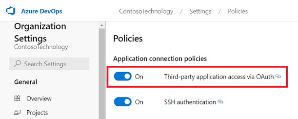

# Set up the Azure DevOps service for Azure DevOps Wiki connector ingestion

The Azure DevOps Wiki Microsoft 365 Copilot connector indexes project wikis and code wikis from your Azure DevOps Services instance into Microsoft 365. This article provides information about the configuration steps that Azure DevOps admins and Microsoft 365 admins must complete to deploy the Azure DevOps Wiki connector. For information about how to deploy the connector, see [Deploy the Azure DevOps Wiki connector](azure-devops-wiki-deployment.md).

## Setup checklist

The following checklist lists the steps involved in configuring the environment and setting up the connector prerequisites.

| Task | Role |
|------|------|
| [Identify Azure DevOps organization](#identify-the-azure-devops-organization-url) | Azure DevOps admin |
| [Enable third-party OAuth access](#enable-third-party-oauth-access) | Azure DevOps admin |
| [Identify the crawl account](#identify-the-crawl-account) | Azure DevOps admin |
| [Grant Azure DevOps access to the crawl account](#grant-azure-devops-access-to-the-crawl-account) | Azure DevOps admin |

## Identify the Azure DevOps organization URL

Identify the Azure DevOps organization URL. For example:

- Azure DevOps URL: `https://dev.azure.com/contoso`
- Organization name: `contoso`

Only the organization name is required for the connector configuration.

## Enable third-party OAuth access

To allow the connector to connect to your Azure DevOps organization, you must enable **Third-party application access via OAuth** in Organization settings. For more information, see [manage security policies](/azure/devops/organizations/accounts/change-application-access-policies?view=azure-devops#manage-a-policy&preserve-view=true).

## Identify the crawl account

The connector supports two authentication methods:

- **Federated Credential (recommended)** – Uses a Microsoft-published Microsoft Entra service principal as the crawl service account. The permissions granted to this service principal in Azure DevOps determine what the connector can index.
- **Microsoft Entra ID OAuth** – Uses delegated OAuth where the signed-in Microsoft 365 admin account acts as the crawl service account. In this case, the Azure DevOps permissions assigned to that admin account determine what the connector can index.

If you use Microsoft Entra ID OAuth, ensure the Microsoft 365 admin account that configures the connector:

- Has access to **Copilot** > **Connectors** in the Microsoft 365 admin center.
- Can be added to the Azure DevOps organization and projects that you want to index.

## Grant Azure DevOps access to the crawl account

Grant the crawl account the necessary permissions in Azure DevOps:

- Assign **Basic** access level.
- Add the service principal (or user) to each project to be indexed.
- Add the service principal (or user) to the **Project Readers** group (or equivalent).

The following table lists the permissions that you must grant to the crawl service account.

| Permission name | Permission type | Required to |
|------------------|------------------|---------------|
| View project-level information | [Project permission](/azure/devops/organizations/security/permissions?view=azure-devops&tabs=preview-page#project-level-permissions&preserve-view=true) | Crawl Azure DevOps Wiki (required for projects to be indexed) |

> [!IMPORTANT]
> The crawl account must have **Basic** access level. Crawls fail with Stakeholder access. To learn more about access levels in Azure DevOps, see [supported access levels](/azure/devops/organizations/security/access-levels).

## Next step

> [!div class="nextstepaction"]
> [Deploy the Azure DevOps Wiki connector](azure-devops-wiki-deployment.md)
