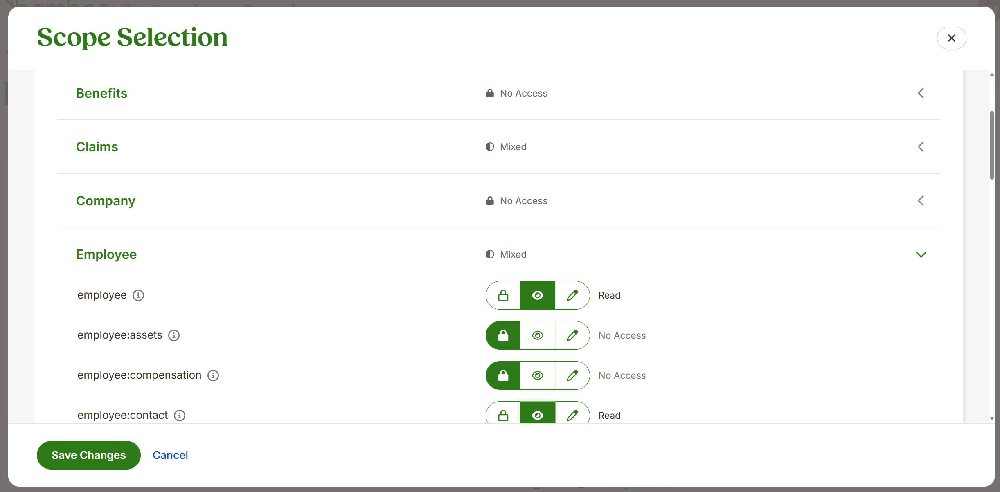

# BambooHR Microsoft 365 Copilot connector

The [Microsoft 365 Copilot connector for people data](/graph/peopleconnectors) allows organizations to index data from external systems, including BambooHR, into Microsoft 365. The BambooHR Microsoft 365 Copilot connector allows organizations to index profiles from BambooHR into Microsoft Graph to make them accessible across Microsoft 365 experiences, including Microsoft 365 Copilot and Microsoft Search.

The following video provides an overview of the BambooHR connector.

> [!VIDEO https://www.youtube-nocookie.com/embed/kpzXm_eKKkg] 

## Capabilities

- Comprehensive profile indexing automatically syncs essential employee information from BambooHR including names, contact details, job titles, departments, hire dates, and organizational hierarchy.
- Enhanced Microsoft 365 Copilot experiences enable your end users to ask natural language questions about colleagues and receive intelligent responses based on BambooHR profile data. Use [Semantic search](/microsoft-365-copilot/connectors/semantic-index-for-copilot) in Copilot to help users find relevant colleagues based on keywords, skills, departments, locations, and organizational relationships.
- Real-time data synchronization keeps employee information current with default incremental syncs every 15 minutes and full synchronization daily.
- Seamless Microsoft 365 integration makes profile data discoverable across Microsoft 365 experiences, enhancing collaboration, and organizational awareness.
- Automated identity mapping intelligently matches BambooHR profiles with Microsoft Entra ID users for accurate cross-platform identity correlation.

For more information, see [Microsoft 365 Copilot connector for people data](/graph/peopleconnectors).
  > [!Note]
  > When you ask Copilot about a person, the citation appears as **office.com** instead of **BambooHR**, because profile information in Microsoft 365 can come from multiple sources. For example, job titles might come from BambooHR, while names and other details might come from Microsoft Entra or other connected systems.

## Limitations

- Data indexing scope is focused on core employee profile information to optimize Microsoft 365 experiences and Copilot. Time off, documents, benefits, trainings, assets, notes, emergency, onboarding, offboarding, and custom properties are outside the current indexing scope.
- Access permissions allow the connector to index profile data that is accessible to all users in your Microsoft tenant, ensuring broad discoverability of employee information across Microsoft 365 experiences and Copilot. Granular user-level permission controls will be available in future updates.
- Identity mapping requires work email addresses in BambooHR to match the UserPrincipalName (UPN) or email addresses in Microsoft Entra for successful profile mapping. This ensures accurate identity correlation between systems.
- Schema configuration uses a predefined set of employee profile properties optimized for Microsoft 365 and Copilot integration. For a complete list of indexed properties, see the [schema mapping table](#3-choose-authentication-type).
- Active employee focus automatically filters to include only active employees, ensuring your Microsoft 365 directory and Copilot reflect the current organizational structure.
  > [!Note]
  > BambooHR treats employees without a populated hire (or original hire) date as inactive, and these profiles are excluded from indexing.

## Prerequisites

1. Access the [BambooHR developer portal](https://developers.bamboohr.com/) and sign in with your existing BambooHR developer account credentials, or create a new developer account if you don't have one. Note that the developer portal is separate from your main BambooHR instance and is used specifically for creating and managing API applications that integrate with BambooHR.
1. In the developer portal, create a new BambooHR app by providing a unique application name (for example, "Microsoft 365 Copilot connector" or your organization's name). 
   
   
   
1. In the app details section, add the redirect URL that Microsoft 365 will use to communicate with BambooHR during authentication. Copy and paste this exact URL: `https://gcs.office.com/v1.0/admin/oauth/callback`
   
     

   
   
1. In the application scopes section, select the required permissions that allow the connector to access specific employee data from BambooHR. Select the following scopes with read-only access to ensure the connector can retrieve the necessary profile information:  

   | Category         | Required scopes                                                                                                                                          |
   |: ---------------- |: -------------------------------------------------------------------------------------------------------------------------------------------------------- |
   | Claims         | email openid                                                                                                                                          |
   | Employee     | employee employee:contact employee:identification employee:job employee:management employee:name employee_directory sensitive_employee:protected_info |
   | Miscellaneous| field offline_access public.user                                                                                                                   |
   | Reports      | report                                                                                                                                                   |
   
   :::image type="content" source="media/bamboohr-connector/bamboohr-select-scopes.png" alt-text="Screenshot of Select Scopes." lightbox="media/bamboohr-connector/bamboohr-select-scopes.png":::
   
   
   
1. Navigate to the **app credentials** section to obtain the App client ID and App client secret. These credentials will be used to authenticate the Microsoft 365 connector with your BambooHR application during setup.
   
   :::image type="content" source="media/bamboohr-connector/bamboohr-client-id-and-secret.png" alt-text="Screenshot of Client Id and Client Secret Section." lightbox="media/bamboohr-connector/bamboohr-client-id-and-secret.png":::

## Get started

[Add BambooHR Microsoft 365 Copilot connector.](https://admin.microsoft.com/adminportal/home?#/microsoft-365-copilot/connectors/Connectors/add)

:::image type="content" source="media/bamboohr-connector/bamboohr-add-connector.png" alt-text="Screenshot of Adding BambooHR Microsoft 365 Copilot connector from the Catalogue." lightbox="media/bamboohr-connector/bamboohr-add-connector.png":::

### 1. Choose a display name

Choose a display name, for example, BambooHR Profiles, that helps users easily recognize associated profiles in a Copilot response.

### 2. Add the instance URL

Enter your BambooHR instance URL, for example, https://contoso.bamboohr.com/ 

### 3. Choose authentication type

Select OAuth 2.0 from the list of authentication types, and enter the client ID and client secret from your BambooHR Developer portal. When you click **Authorize**, you're required to sign in with your admin credentials from the BambooHR instance containing your employee data and consent to the required permissions.

For other settings, like access permissions, data inclusion rules, schema, crawl frequency, etc., we set defaults based on what works best with data in BambooHR. The default value settings are as follows.

|Page|Settings|Default values|
| :--- | :--- | :--- |
|Users | Access Permissions    _Note: All data retrieved through the BambooHR Copilot connector is visible to everyone in your Microsoft tenant. However, we aren't changing the system's behavior, such as respecting access restrictions. If a user is blocked from seeing another user's profile data, that profile data (including BambooHR Copilot data) won't be shared or stored in the blocked user's view. Access-restricted data will be included in future updates when user-level permission controls are implemented._ | All profiles are accessible to anyone.|
|Map identities| Data source identities mapped using Microsoft Entra IDs. |
|Sync | Incremental crawl | Frequency: every 15 minutes.|
|Sync | Full crawl | Frequency: every day.|

| Schema property |Description | [Property in Microsoft 365 user profile schema](/graph/api/resources/profile) |
| :--- | :--- | :--- |
| First name | Employee's first Name | names->first |
| Last name | Employee's last Name | names->last |
| Name | Employee's full names | names->displayName |
| Email | Employee's work email address | emails->address[type='work']  *Note: Email is converted to the Microsoft Entra objectId of the end user and is used for internal processing.* |
| Birth date | Employee's date of birth | anniversaries->date[type='birthday'] |
| Job information department | Employee's job department, for example, human resources | positions->detail->company->department |
| Job information division | Employee's job division, for example, North America | position->detail->company->division |
| Employee number | Employee's number | position->detail->employeeId |
| Employee Eeid | Employee's ID in BambooHR | webAccounts->userId  *Note: The employee's eeid is also utilized internally to periodically check for any updates for a given Employee in BambooHR*. |
| Employment status | Employee's Status, for example, full-time, contractor, Etc. | position->detail->employeeType |
| Original hire date time | Employee's date of hire | anniversaries->date[type='originalHireDate'] |
| Hire date time | Employee's date of hire    _Note: When Original hire date time is null, we index the Hire Date Time_ | anniversaries->date[type='originalHireDate'] |
| Job information job title | Employee's job title, for example, Senior HR Administrator | positions->detail->jobTitle |
| Supervisor ID | Employee's manager identifier | positions->manager->userId  *Note: The supervisor ID is used to find the supervisor's email, which is then converted to the Microsoft Entra objectId of the manager for internal processing.* |
| Mobile phone | Employee's work mobile phone | phones->number(type=mobile) |
| Work phone | Employee's work phone | phones->number(type=work) |
| Job information location | Employee's office location | positions->positionDetail->companyDetail->officeLocation |
| Status | Employee's status, for example, active or inactive | N/A  *Note: Internal use for filtering inactive employees, ensuring they're excluded from BambooHR data retrieval.* |

## Custom setup

In custom setup, you can edit any of the default values for users, content, and sync.

### Users

The BambooHR Copilot connector only supports data visible to Everyone. This means indexed data appears in the search results for all users.
The BambooHR Copilot connector only supports mapping your data source identities with Microsoft Entra ID by checking whether the email address of BambooHR profiles is the same as UserPrincipalName (UPN), or the email of users in Microsoft Entra ID. 

### Content

The BambooHR Copilot connector doesn't support the addition of new properties or the removal of existing properties on this tab. Within this tab, there's a property named annotationSerialized that encompasses all the default properties previously mentioned.

### Sync

The refresh interval determines how often your data is synced between the data source and the BambooHR Copilot connector index. There are two types of refresh intervals – full crawl and incremental crawl. For more information, see [refresh settings](deployment-overview.md#guidelines-for-crawl-settings).

## Next steps

After you publish your connection, you can review the status in the **Connectors** section of the [admin center](https://admin.microsoft.com). To learn how to make updates and deletions, see [Manage your connector](manage-connector.md).

If you have issues or want to provide feedback, see [Microsoft Graph support](https://developer.microsoft.com/graph/support). 
