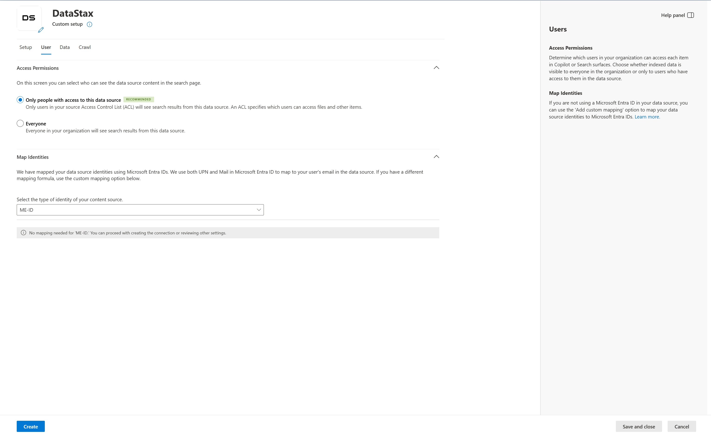
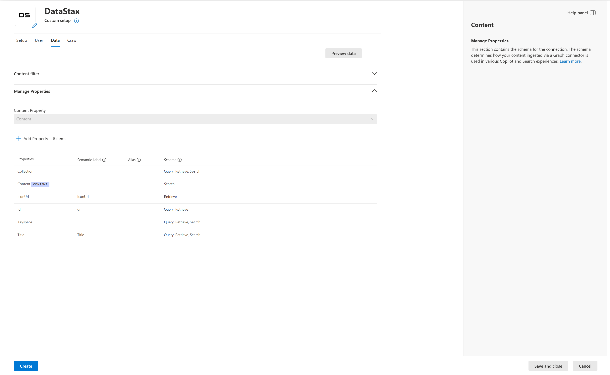
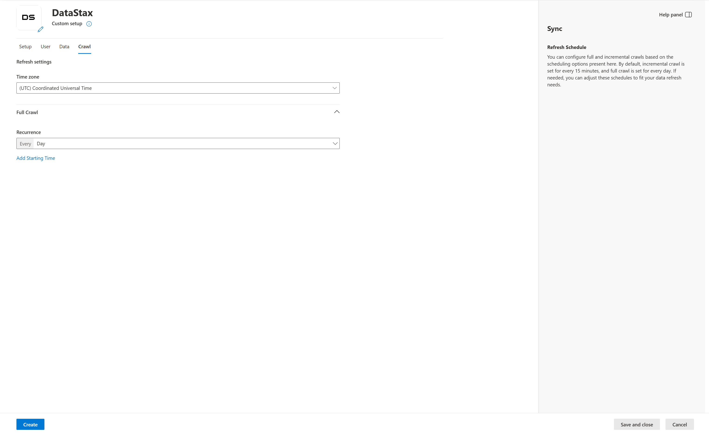

# Deploy the DataStax connector (preview)

The DataStax Microsoft 365 Copilot connector integrates DataStax Astra DB collections into Microsoft 365, enabling Copilot, Copilot Search, and Microsoft Search to surface database records directly within apps like Teams, Outlook, and SharePoint.

This article describes the steps to deploy, customize, and manage the DataStax Copilot connector. For general information about Copilot connector deployment, see [Set up Copilot connectors in the Microsoft 365 admin center](/microsoft-365/copilot/connectors/deployment-overview).

[!INCLUDE [connector-preview-access](includes/connector-preview-access.md)]

## Prerequisites

To deploy the connector, you must meet the following prerequisites:

- You're an admin for your organization's Microsoft 365 tenant.
- You must have access to a DataStax Astra DB database.
- You must have the DataStax API Endpoint for your database.
- You must have the DataStax database ID.
- You must have an application token with read permissions for the database.
- You must have authentication credentials with the appropriate access for both Microsoft 365 and DataStax.

## Set up DataStax application token

Before deploying the connector, you need to generate an application token in DataStax Astra DB to authenticate the connector and provide read access to your database collections.

### Generate an application token in DataStax

To generate an application token in DataStax Astra DB:

1. Sign in to your [DataStax Astra DB](https://astra.datastax.com) account.
1. Go to your database overview page.
1. Find the **Token Management** or **Generate Token** section.
1. Select **Generate Token** or **Create Token**.
1. Choose a role for the token:
   - **Recommended**: Use the **Read Only User** role to give read access to database collections.
   - Make sure the role has enough permissions to access all collections you want to index.
1. Select **Generate Token** to create the token.
1. Copy the generated application token right away. The token usually starts with `AstraCS:...` and is a long string.

> [!IMPORTANT]
> Store the application token securely. You need this token to authenticate the connector during deployment. The token is shown only once during generation.

### Get DataStax API Endpoint and database ID

While you're in your DataStax Astra DB database overview, also collect the following information:

- **API Endpoint**: The REST API endpoint for your database, usually in the format: `https://<your-database-id>-<region>.apps.astra.datastax.com`
- **Database ID**: The unique identifier for your database, shown in the database overview

You need both values when deploying the connector in the Microsoft 365 admin center.

## Deploy the connector

To add the DataStax connector for your organization:

1. In the Microsoft 365 admin center, in the left pane, choose **Copilot** > **Connectors**.
1. Select the **Connectors** tab. In the left pane, select **Gallery**.
1. From the list of available connectors, choose **DataStax**.

### Set display name

Use the display name to identify references in Copilot responses so users can recognize the associated database record or item. The display name also signifies trusted content and is used as a [content source filter](/microsoftsearch/custom-filters#content-source-filters).

You can accept the default **DataStax** display name, or customize the value to use a display name that users in your organization recognize.

For more information about connector display names and descriptions, see [Enhance Copilot discovery with Microsoft 365 Copilot connectors content](/microsoft-365/copilot/connectors/enhance-copilot-discovery).

### Set DataStax API endpoint

To connect to your DataStax database, enter the DataStax API Endpoint. You can find the endpoint in the overview of your database in DataStax Astra DB.

The API Endpoint is typically in the following format:

`https://<your-database-id>-<region>.apps.astra.datastax.com`

Where:
- `<your-database-id>` is the unique identifier for your database
- `<region>` is the geographic region where your database is hosted (for example, `us-east-1`, `eu-west-1`)

> [!TIP]
> You can find the API Endpoint in your DataStax Astra DB database overview page under the **Connect** or **API** section.

### Set DataStax database ID

Enter the DataStax database ID to specify which database the connector should access. The database ID is a unique identifier for your Astra DB database.

You can find the database ID in the DataStax Astra DB database overview page.

### Choose authentication type

The DataStax connector uses **DataStax Application Token** for authentication. To authenticate and synchronize database records from DataStax:

1. Select **DataStax Application Token** as the authentication type.
1. Paste the application token that you generated in DataStax Astra DB.
   - The token starts with `AstraCS:...`
   - Make sure you copy the entire token without truncation.
1. Select **Authorize** to validate the token and establish the connection.

> [!NOTE]
> The application token must have at least **Read Only User** permissions to access database collections. For more information, see [Generate an application token in DataStax](#generate-an-application-token-in-datastax).

### Roll out

Deploy the connection to a limited set of users to validate it in Copilot and other search surfaces before you roll it out to a broader audience. For more information, see [Staged rollout for Microsoft 365 Copilot connectors](/microsoft-365/copilot/connectors/staged-rollout).

To roll out to a limited audience, choose the toggle next to **Rollout to limited audience** and specify the users and groups to roll the connector out to.

To deploy the connector, choose **Create** in the Microsoft 365 admin center. The DataStax Copilot connector starts indexing database records from your DataStax Astra DB account right away.

The following table lists the default values that are set. These values work best with DataStax Astra DB data.

| Category | Setting | Default value |
|----------|---------|---------------|
| Users | Access permissions | Only people with access to the content in the data source |
| Users | Map identities | Data source identities mapped using Microsoft Entra IDs |
| Content | Manage properties | For default properties and schemas, see [Manage properties](#manage-properties) |
| Sync | Full crawl | Frequency: Every day |

To customize these values, see [Customize settings](#customize-settings-optional).

After you create your connection, you can review the status in the **Connectors** section of the [Microsoft 365 admin center](https://admin.microsoft.com/).

## Customize settings (optional)

You can customize the default values for the DataStax connector settings. To customize settings, on the connector page in the admin center, choose **Custom setup**.

### Customize user settings

The DataStax connector supports the following user search permissions:

- Everyone
- Only people with access to this data source (default)

If you choose **Everyone**, indexed database data appears in the search results for all users. If you choose **Only people with access to this data source**, indexed database data appears in the search results for users who have access to it.

If you choose **Only people with access to this data source**, you also need to choose whether your DataStax account has Microsoft Entra ID provisioned users or non-Entra ID users:

- Choose the Microsoft Entra ID option if the email ID of DataStax users is the same as the user principal name (UPN) in Microsoft Entra ID.
- Choose the non-Entra ID option if the email ID of DataStax users is different from the UPN in Microsoft Entra ID. For more information about identity mapping, see [Map your non-Entra ID identities](map-non-entra-id.md).

### Customize content settings

You can customize the content that the DataStax connector indexes by configuring properties and schemas.

#### Manage properties

The DataStax connector indexes the following properties from DataStax Astra DB collections. To view available properties, assign a schema to the property (define whether a property is searchable, queryable, retrievable, or refinable), change the semantic label, or add an alias to the property. Some properties are selected by default.

| Source property | Label | Description | Schema attributes |
| --------------- | ----- | ----------- | ----------------- |
| Collection | Not applicable | The collection name where the record is stored. | Query, Retrieve, Search |
| Content | Not applicable | The record content in the collection. | Search |
| iconUrl | iconUrl | The icon URL associated with the record. | Retrieve |
| Id | url | The unique record ID in the collection. This serves as the URL to identify the record. | Query, Retrieve |
| Keyspace | Not applicable | The keyspace for the collection. | Query, Retrieve, Search |
| Title | title | The title created by combining the collection name and the record ID. This is the primary identifier shown in search results and Copilot responses. | Query, Retrieve, Search |

> [!TIP]
> Consider making the **Content** and **Title** properties searchable to improve the relevance of Copilot responses when users query for database information.

#### Preview data

Use the **Preview results** button to verify the sample values of the selected properties. This step helps you confirm that the connector is indexing the expected data from your DataStax collections.

### Customize sync settings

The DataStax connector supports only full crawl. Incremental crawl isn't available for this connector.

The default schedule for the full crawl is set to **Every day**. This schedule means that the connector re-indexes all database records once per day.

You can adjust the full crawl schedule to fit your data refresh needs:

- If your database collections change frequently, keep the daily full crawl frequency.
- If your database content is relatively static, you can reduce the crawl frequency to every few days.

To adjust the crawl schedule:

1. In the connector settings, navigate to the **Sync** section.
1. Under **Full crawl**, choose the desired frequency from the dropdown.
1. Choose **Save** to apply the changes.

For more information about sync settings, see [Guidelines for crawl settings](deployment-overview.md#guidelines-for-crawl-settings).

> [!NOTE]
> Changes to the crawl frequency affect how quickly updates to DataStax collections are reflected in Copilot and Microsoft Search results.

## Manage your connector

After you publish your connection, you can review the status in the **Connectors** section of the [Microsoft 365 admin center](https://admin.microsoft.com/). For more information, see [Manage your connector](manage-connector.md).

The connector status page shows the following information:

- **Last crawl status**: Indicates whether the most recent crawl completed successfully or encountered errors.
- **Items indexed**: The number of database records currently indexed and available in Copilot and Microsoft Search.
- **Crawl history**: A log of recent crawl operations, including start time, duration, and results.

If the connector encounters errors, see [Troubleshoot the DataStax connector](datastax-troubleshooting.md) for resolution steps.

## Next step

> [!div class="nextstepaction"]
> [Troubleshoot the DataStax connector](datastax-troubleshooting.md)

## Related content

- [DataStax connector overview](datastax-overview.md)
- [Troubleshoot issues with the DataStax connector](datastax-troubleshooting.md)
- [Set up Copilot connectors in the Microsoft 365 admin center](deployment-overview.md)
