# Enterprise Websites cloud connector

By using the Enterprise Websites cloud Microsoft 365 Copilot connector, your organization can index webpages and **content from your company-owned websites** or public websites on the internet. After you configure the connector and index content from the website, end users can search for that content in Microsoft Search and Microsoft 365 Copilot.

>[!IMPORTANT]
>To index websites hosted on-premises or on private clouds, use the [Enterprise Websites on-premises Copilot connector](enterprise-web-connector-onprem.md).

## Capabilities
- Index webpages from cloud accessible websites.
- Index up to 50 websites in a single connection.
- Exclude webpages from crawl using exclusion rules.
- Use [Semantic search in Copilot](/microsoftsearch/semantic-index-for-copilot) to enable users to find relevant content.

These are the supported file types.

| File extension | File type | Description | 
| -------------- | --------- | ----------- |
| .pdf | PDF | Portable Document Format |
| .odt | OpenDocument Text | OpenDocument Text Document |
| .ods | OpenDocument Spreadsheet | OpenDocument Spreadsheet |
| .odp | OpenDocument Presentation | OpenDocument Presentation |
| .odg | OpenDocument Graphics | OpenDocument Graphics |
| .xls | Excel (Old) | Excel Spreadsheet (Old Format) |
| .xlsx | Excel (New) | Excel Spreadsheet (New Format) |
| .ppt | PowerPoint (Old) | PowerPoint Presentation (Old Format) |
| .pptx | PowerPoint (New) | PowerPoint Presentation (New Format) |
| .doc | Word (Old) | Word Document (Old Format) |
| .docx | Word (New) | Word Document (New Format) |
| .csv | CSV | Comma-Separated Values |
| .txt | Plain Text | Plain Text File |
| .xml | XML | Extensible Markup Language |
| .md | Markdown | Markdown File |
| .rtf | Rich Text Format | Rich Text Format |
| .tsv | Tab Separated Values | Tab-Separated Values |
| .gif | GIF | Graphics Interchange Format |
| .jpeg | JPEG | JPEG Image |
| .jpg | JPG | JPEG Image |
| .png | PNG | Portable Network Graphics |
| .mp3 | MP3 | MPEG Audio Layer III |
| .wav | WAV | Waveform Audio File Format |
| .aiff | AIFF | Audio Interchange File Format |
| .flac | FLAC | Free Lossless Audio Codec |
| .aac | AAC | Advanced Audio Coding |
| .alac | ALAC | Apple Lossless Audio Codec |
| .wma | WMA (Lossy) | Windows Media Audio (Lossy) |
| .wma | WMA (Lossless) | Windows Media Audio (Lossless) |
| .ogg | OGG | Ogg Vorbis Audio Format |
| .pcm | PCM | Pulse-Code Modulation Audio |
| .mp4 | MP4 | MPEG-4 Video File |
| .mkv | MKV | Matroska Video File |
| .avi | AVI | Audio Video Interleave |
| .wmv | WMV | Windows Media Video |
| .mov | MOV | Apple QuickTime Movie |
| .flv | FLV | Flash Video Format |
| .avchd | AVCHD | Advanced Video Coding High Definition |
| .webm | WebM | Web Media File |
| .mpeg | MPEG-2 | Moving Picture Experts Group Format |
| .hevc | HEVC/H.265 | High Efficiency Video Coding |

These are the supported MIME types.

| MIME type | Description |
| --------- | ----------- |
| text/html | HyperText Markup Language (HTML) used to format the structure of a webpage. |
| text/webviewhtml | MIME type used for web content rendered in WebView controls. |
| text/x-server-parsed-html | Server-parsed HTML documents, often used for Server Side Includes (SSI). |

## Limitations
- Doesn't support authentication mechanisms like SAML, JWT token, Forms-based authentication, and similar methods.
- Doesn't support crawling of dynamic content in webpages.

## Prerequisites
- You must be the **AI administrator** for your organization's Microsoft 365 tenant.
- **Website URLs**: To connect to your website content, you need the URL to the website. You can index multiple websites (up to 50) in a single connection. 
- **Service Account (optional)**: You need a service account only when your websites require authentication. Public websites don't require authentication and can be crawled directly. For websites requiring authentication, use a dedicated account to authenticate and crawl the content.

## Get Started

[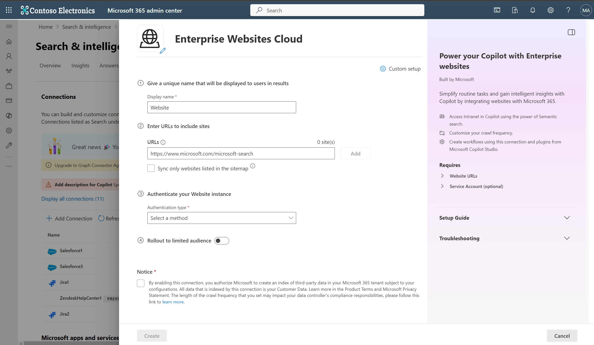](media/enterprise-web-connector/enterprise-website-cloud-create-page.png#lightbox)

### Display name 
A display name identifies each citation in Copilot, so users can easily recognize the associated file or item. The display name also signifies trusted content. Use the display name as a [content source filter](/microsoftsearch/custom-filters#content-source-filters). A default value is present for this field, but you can customize it to a name that users in your organization recognize.

### Add website URLs to index
Specify the root of the website that you want to crawl. The Enterprise Websites cloud Copilot connector uses this URL as the starting point and follows all the links from this URL for its crawl. You can index up to 50 different site URLs in a single connection.

The connector only crawls webpages in the domain of root URLs and doesn't support crawling of out-of-domain URLs. Redirection is only supported within the same domain. If there are redirections in the webpages to be crawled, you can add the redirected URL directly in the list of URLs to crawl.

**Use sitemap for crawling**

When selected, the connector only crawls the URLs listed in the sitemap. This option also allows you to configure incremental crawling during a later step. If not selected or no sitemap is found, the connector does a deep crawl of all the links found on the root URL of the site.

When you select this option, the crawler performs the following steps:

1. The crawler looks for the `robots.txt` file in the root location. For example, if your provided URL is `https://www.contoso.com`, the crawler looks for the `robots.txt` file at `https://www.contoso.com/robots.txt`.

1. Upon locating the `robots.txt` file, the crawler finds the sitemap links in the `robots.txt` file.

1. The crawler then crawls all webpages as listed in the sitemap files.

1. If there's failure in any of the preceding steps, the crawler performs a deep crawl of the website, without throwing any error.

**Index only pages under the specified subdirectory**

The Website connector offers an option to index only webpages that are under the specified subdirectory. 

- When you **don't check** this option, the connector always starts crawling from the root of the URL. For example, if your provided URL is `https://www.contoso.com/electronics`, the connector starts crawl from `https://www.contoso.com`.
- When you **check** this option, the connector starts crawling from the exact input URL. For example, if your provided URL is `https://www.contoso.com/electronics`, the connector starts crawl from `https://www.contoso.com/electronics`.

### Provide authentication type
The authentication method you choose applies to all websites you provide to index in a connection. To authenticate and sync content from websites, choose **one of the five** supported methods: 

a. **None**  
Select this option if your websites are publicly accessible without any authentication requirements.  

b. **Basic authentication**  
To authenticate by using basic authentication, enter your account's username and password.  

> [!TIP]
> Try multiple permutations of the username for authentication. Examples include:
> * username
> * username@domain.com
> * domain/username

c. **SiteMinder**  
SiteMinder authentication requires a properly formatted URL, `https://custom_siteminder_hostname/smapi/rest/createsmsession`, a username, and a password.

d. **Microsoft Entra OAuth 2.0 Client credentials**  
OAuth 2.0 with [Microsoft Entra ID](/azure/active-directory/) requires a resource ID, client ID, and a client secret.

The resource ID, client ID, and client secret values depend on how you set up Microsoft Entra ID-based authentication for your website. One of the two specified options might be suitable for your website:

1. If you're using a Microsoft Entra application both as an identity provider and the client app to access the website, the client ID and the resource ID are the application ID of this single application, and the client secret is the secret that you generated in this application.
    
    > [!NOTE]
    > For detailed steps to configure a client application as an identity provider, see [Quickstart: Register an application with the Microsoft identity platform and Configure your App Service or Azure Functions app to use Microsoft Entra login](/azure/app-service/configure-authentication-provider-aad).

    After you configure the client app, make sure you create a new client secret by going to the **Certificates & Secrets** section of the app. Copy the client secret value shown in the page because it isn't displayed again.

    In the following screenshots, you can see the steps to obtain the client ID, and client secret, and set up the app if you're creating the app on your own.
    
    * View of the settings in the branding section:
    
      > [!div class="mx-imgBorder"]
      > [ 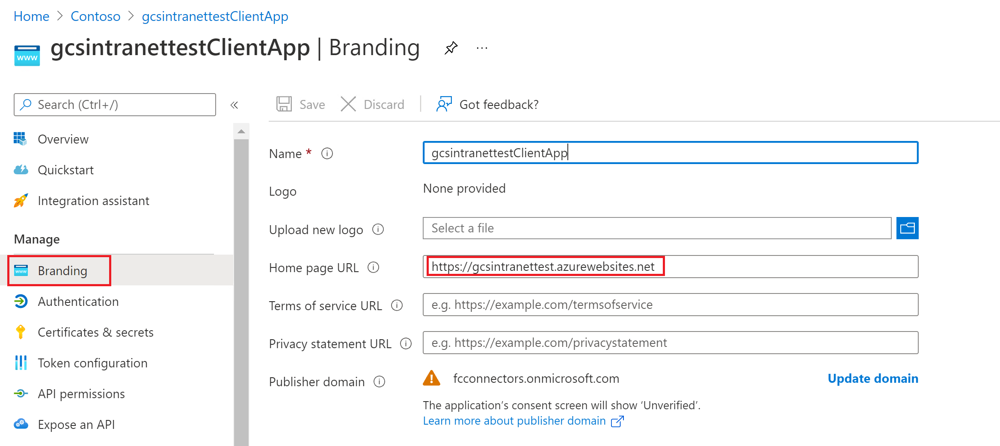 ](media/enterprise-web-connector/connectors-enterpriseweb-branding.png#lightbox)
    
    * View of the settings in the authentication section:
    
      > [!div class="mx-imgBorder"]
      > [ 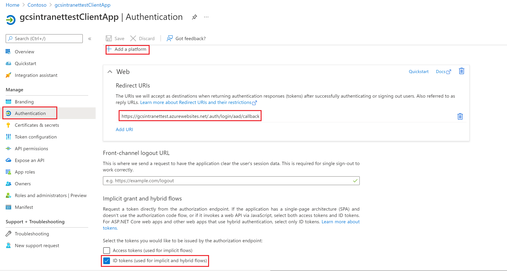 ](media/enterprise-web-connector/connectors-enterpriseweb-authentication.png#lightbox)
    
      > [!NOTE]
      > It isn't required to have the above-specified route for the redirect URI on your website. Only if you use the user token sent by Azure in your website for authentication you need to have the route.
    
    * View of the client ID on the **Essentials** section:
    
      > [!div class="mx-imgBorder"]
      > [ 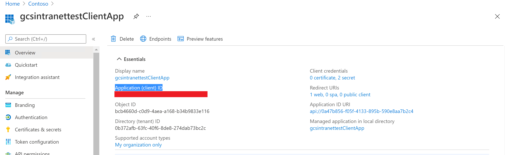 ](media/enterprise-web-connector/connectors-enterpriseweb-clientapp-clientidresource-id.png#lightbox)
    
    * View of the client secret on the **Certificates & secrets** section:
    
      > [!div class="mx-imgBorder"]
      > [ 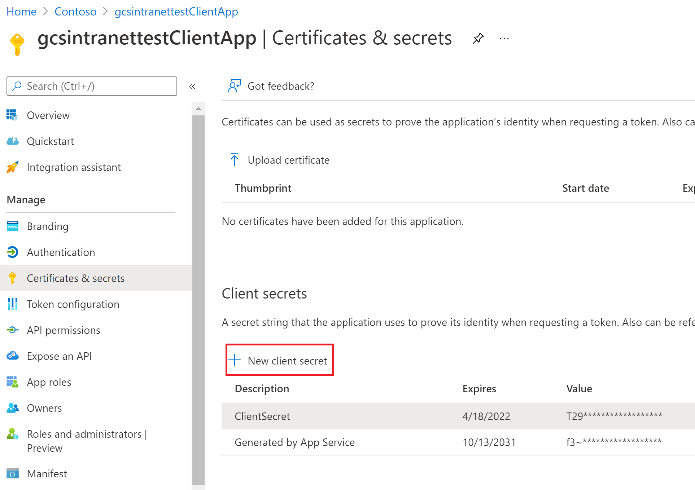 ](media/enterprise-web-connector/connectors-enterpriseweb-client-secret.png#lightbox)
    
2. If you're using an application (first app) as an identity provider for your website as the resource, and a different application (second app) to access the website, the client ID is the application ID of your second app and the client secret is the secret configured in the second app. However, the resource ID is the ID of your first app.

    > [!NOTE]
    > For steps to configure a client application as an identity provider see [Quickstart: Register an application with the Microsoft identity platform](/azure/active-directory/develop/quickstart-register-app) and [Configure your App Service or Azure Functions app to use Microsoft Entra login](/azure/app-service/configure-authentication-provider-aad).

You don't need to configure a client secret in this application, but you need to add an app role in the **App roles** section, which you later assign to your client application. Refer to the images to see how to add an app role.

    * Creating a new app role:
    
      > [!div class="mx-imgBorder"]
      > [ 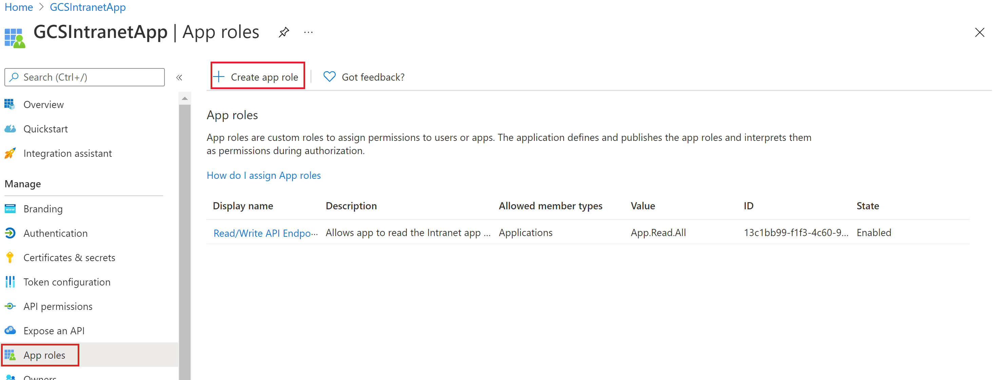 ](media/enterprise-web-connector/connectors-enterpriseweb-new-app-role.png#lightbox)
    
    * Editing the new app role:
    
      > [!div class="mx-imgBorder"]
      > [ 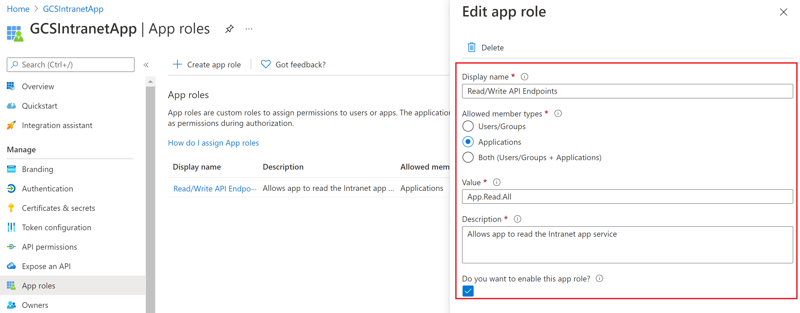 ](media/enterprise-web-connector/connectors-enterpriseweb-new-app-role2.png#lightbox)
    
      After configuring the resource app, create the client app and give it permission to access the resource app by adding the app role you configured in the API permissions of the client app. 
    
      > [!NOTE]
      > To see how to grant permissions to the client app, see [Quickstart: Configure a client application to access a web API](/azure/active-directory/develop/quickstart-configure-app-access-web-apis).
    
    The following screenshots show the section to grant permissions to the client app.
    
    * Adding a permission:
    
      > [!div class="mx-imgBorder"]
      > [ 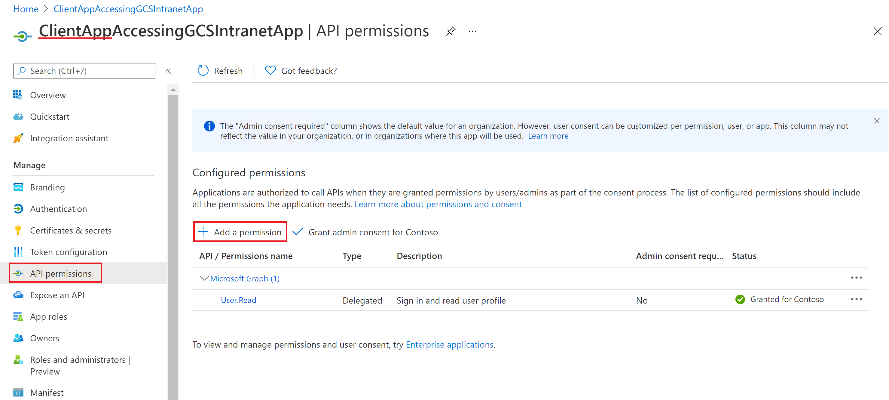 ](media/enterprise-web-connector/connectors-enterpriseweb-adding-permissions.png#lightbox)
    
    * Selecting the permissions:
    
      > [!div class="mx-imgBorder"]
      > [ 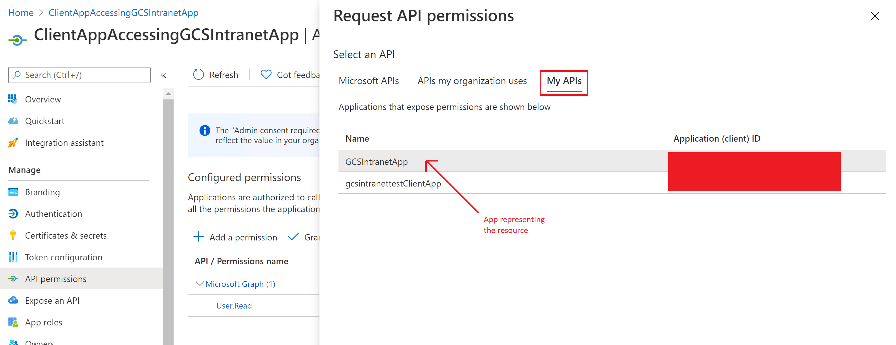 ](media/enterprise-web-connector/connectors-enterpriseweb-adding-permissions2.png#lightbox)
    
    * Adding the permissions:
 
      > [!div class="mx-imgBorder"]
      > [ 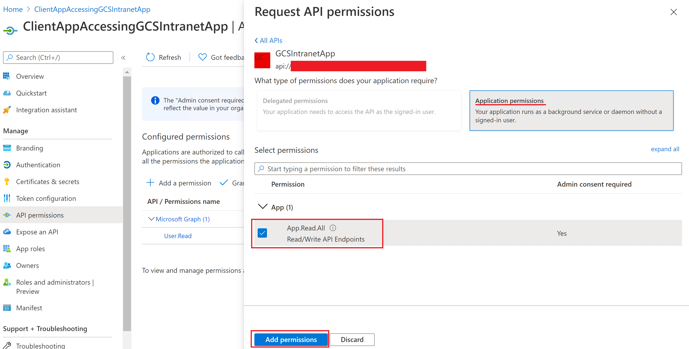 ](media/enterprise-web-connector/connectors-enterpriseweb-adding-permissions3.png#lightbox)
    
    Once you assign the permissions, create a new client secret for this application by going to the **Certificates & secrets** section.
    Copy the client secret value shown on the page as it isn't displayed again. Use the application ID from this app as the client ID, the secret from this app as the client secret, and the application ID of the first app as the resource ID.

e. **OIDC Client Credentials (Any identity provider)**  
The OIDC client credentials flow is designed for machine-to-machine authentication using any identity provider. To configure OIDC client credentials authentication, register an application with the authorization server (for example, Okta, Auth0, Keycloak, Ping Identity, and others).

Inputs required for configuration:
- Client ID: The identifier assigned to the application during registration.
- Client Secret: The secret key assigned to the application during registration.
- Scopes: The list of permissions the application requires. These scopes are predefined on the authorization server. (For example, `read:data write:data admin:operations`)
- Token Endpoint URL: The specific endpoint on the authorization server where tokens are requested.

**Example: Okta OIDC client credentials authentication**

To illustrate an example, let's look at configuring OIDC client credentials authentication with Okta as the identity provider. The following steps are illustrative and might vary as per your implementation. Refer to the [documentation](https://help.okta.com/en-us/content/topics/apps/apps_app_integration_wizard_oidc.htm) by Okta to learn how to configure OIDC authentication.

1. Create an OIDC App Integration in Okta
    - Go to _Applications > Applications_ in the Okta Admin Console.
    - Select _Create App Integration_ and choose _OIDC - OpenID Connect_.
    - Choose Service or Web as the application type.
1. Configure application settings:
    - Application Name: Give your application a descriptive name (for example, "My Client Credentials App").
    - Logo (Optional): Upload a logo if desired.
    - Grant Type: Select Client Credentials. Disable other grant types unless required for other flows.
    - Sign-in redirect URIs: Since you're using client credentials, you don't need to configure any redirect URIs.
    - Logout redirect URIs (Optional): Not usually needed for client credentials.
- Select **Done**.
3. Set Client Authentication Method
    - Select **Client secret** in the **Client Authentication** dropdown.
    - Select **Save** to generate a client secret (you see it only once).
4. Configure Scopes
    - Under **Scopes**, assign OAuth 2.0 scopes, such as `read:data` and `write:data`. These names are just labels - you define what they mean in your application.
    - Ensure scopes align with the API permissions required.
5. Assign the App to Users or Groups
    - In the **Assignments** tab, assign the app to the relevant users or groups.
    - Even for service apps, assignments ensure policies apply correctly.
6. Token Endpoint Configuration
    - The token URL is typically `https://{yourOrg}.okta.com/oauth2/v1/token`.
    - Use this endpoint to request access tokens.

### 4. Roll out to limited audience
Deploy this connection to a limited user base if you want to validate it in Copilot and other Search surfaces before expanding the rollout to a broader audience. To learn more about limited rollout, see [staged rollout](staged-rollout.md).

At this point, you're ready to create the connection for your cloud websites. Select **Create** to publish your connection and index webpages from your websites.

For other settings, like **Access Permissions**, **Data Inclusion Rules**, **Schema**, **Crawl frequency**, and more, the portal provides defaults based on what works best with websites. You can see the default values in the following table:

| Users | Description |
|----|---|
| Access permissions | _Everyone in your organization sees this content_ |

| Content | Description |
|---|---|
| URLs to exclude | _None_ |
| Manage Properties | _To check default properties and their schema, see [content](#content)_ |

| Sync | Description |
|---|---|
| Incremental Crawl | _Frequency: Every 15 mins (only supported with sitemap crawling)_ |
| Full Crawl | _Frequency: Every Day_ |

If you want to change any of these values, select **Custom Setup**.

## Custom Setup

In custom setup, you can change any of the default values for users, content, and sync.

### Users

[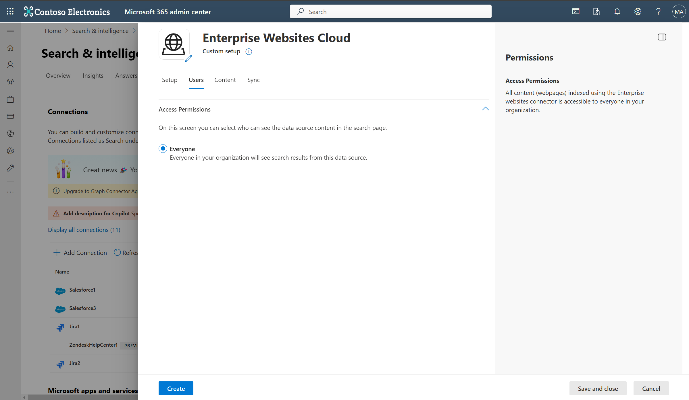](media/enterprise-web-connector/enterprise-website-cloud-users-tab.png#lightbox)

#### Access permissions

The Enterprise Websites cloud Copilot connector supports search permissions visible to **Everyone** only. Indexed data appears in the search results for all users in your organization.

### Content

[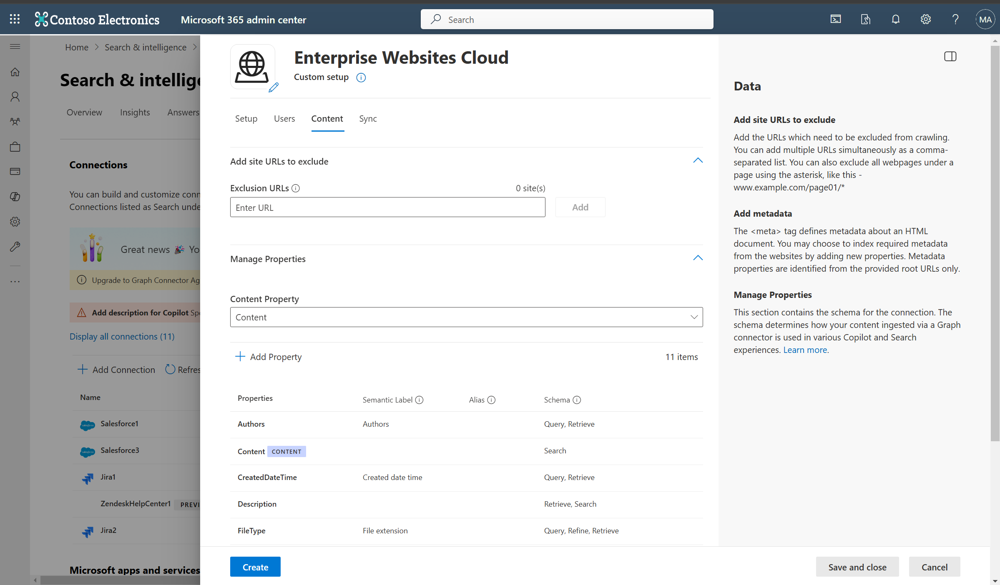](media/enterprise-web-connector/enterprise-website-cloud-content-tab.png#lightbox)

**Add URLs to exclude (Optional crawl restrictions)**

To prevent pages from being crawled, use either of these methods: disallow them in your robots.txt file or add them to the Exclusion list.

1. Support for robots.txt

    The connector checks to see if there's a robots.txt file for your root site. If one exists, it follows and respects the directions found within that file. If you don't want the connector to crawl certain pages or directories on your site, include the pages or directories in the "Disallow" declarations in your robots.txt file.

1. Add URLs to exclude

    You can optionally create an **Exclusion list** to exclude some URLs from getting crawled if that content is sensitive or not worth crawling. To create an exclusion list, browse through the root URL. You can add the excluded URLs to the list during the configuration process.

**Site configuration**

The connector supports two options to customize crawler behavior.

1. Index pages containing a "noindex" directive in their "meta" tag or X-Robots-Tag HTTP response header: Selecting this option forces the crawler to index these pages and override the default crawler behaviour.
2. Ignore 'Allow' and 'Disallow' directives specified in the "robots.txt" file: Selecting this option forces the crawler to ignore the crawl directives in robots.txt file.

**Manage Properties**

Here, you can add or remove available properties from your websites, assign a schema to the property (define whether a property is searchable, queryable, retrievable, or refinable), change the semantic label and add an alias to the property. Properties that are selected by default are listed below.

|Source Property|Label|Description|Schema|
|---|---|---|---|
| Authors | Authors | People who participated on the item in the data source | Query, Retrieve |
| Content | Content | All text content in a webpage | Search |
| CreatedDateTime | Created date time | Data and time that the item was created in the data source | Query, Retrieve |
| Description |  |  | Retrieve, Search |
| FileType | File extension | The file extension of crawled content | Query, Refine, Retrieve |
| IconURL | IconUrl | Icon url of the webpage | Retrieve |
| LastModifiedBy | Last modified by | Person who last modified the item in data source | Query, Retrieve |
| LastModifiedDateTime | Last modified date time | Date and time the item was last modified in the data source. | Query, Retrieve |
| Title | Title | The title of the item that you want shown in Copilot and other search experiences | Retrieve, Search |
| URL | url | The target URL of the item in the data source | Retrieve |

The Enterprise Website cloud Copilot connector supports two types of source properties:

1. Meta tag

    The connector fetches any meta tags your root URLs may have and shows them. You can select which tags to include for crawling. A selected tag gets indexed for all provided URLs, if available. 

    [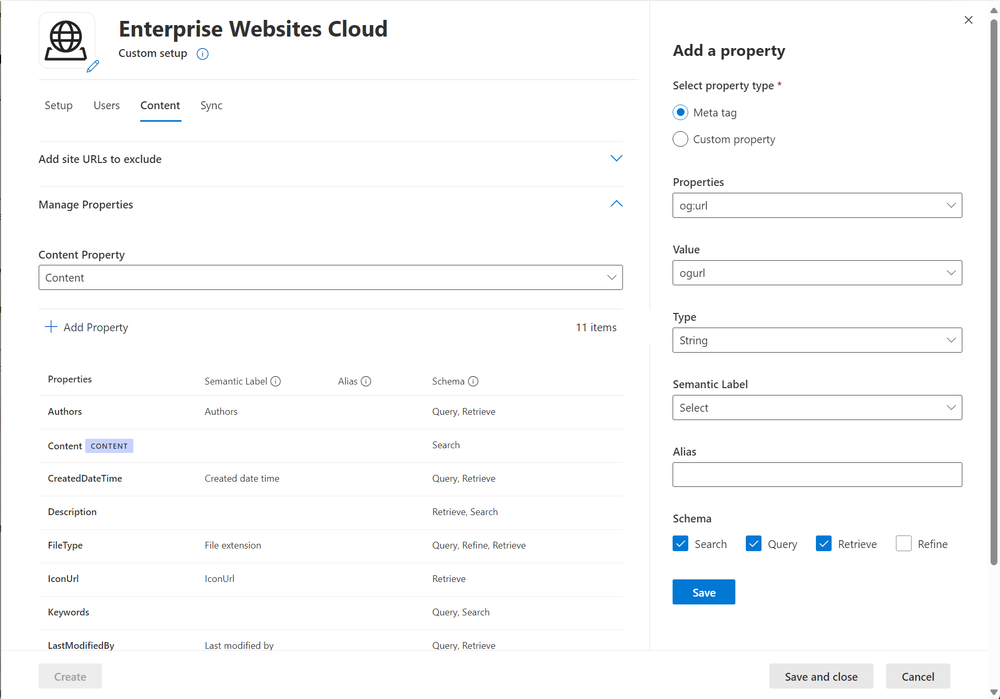](media/enterprise-web-connector/enterprise-website-cloud-metatags.png#lightbox)

    Selected meta tags can be used to create custom properties. Also, on the schema page, you can manage them further (Queryable, Searchable, Retrievable, Refinable).

2. Custom property settings

    You can enrich your indexed data by creating custom properties for your selected meta tags or the connector's default properties. 

    [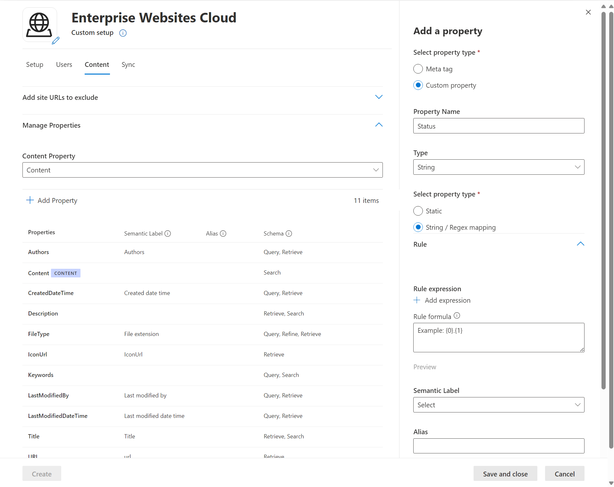](media/enterprise-web-connector/enterprise-website-cloud-custom-property.png#lightbox)

    To add a custom property:

      1. Enter a property name. This name appears in search results from this connector.
      2. For the value, select Static or String/Regex Mapping. A static value is included in all search results from this connector. A string/regex value varies based on the rules you add.
      3. If you selected a static value, enter the value you want to appear.
      4. If you selected a String/rRegex value:
          * In the **Add expressions** section, in the **Property** list, select a default property or meta tag from the list. For **Sample value**, enter a string to represent the type of values that could appear. This sample is used when you preview your rule. For **Expression**, enter a regex expression to define the portion of the property value that should appear in search results. You can add up to three expressions.
          * In the **Create formula** section, enter a formula to combine the values extracted from the expressions. 

To learn more about regex expressions, see [.NET regular expressions](/dotnet/standard/base-types/regular-expressions) or search the web for a regex expression reference guide.

### Sync

[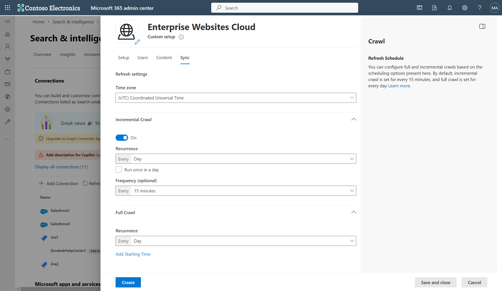](media/enterprise-web-connector/enterprise-website-cloud-sync-tab.png#lightbox)

The refresh interval determines how often your data is synced between the data source and the Copilot connector index. There are two types of refresh intervals - full crawl and incremental crawl. For more information, see [refresh settings](deployment-overview.md#guidelines-for-crawl-settings).

You can change the default values of the refresh interval from here if you want to.

> [!NOTE]
> Incremental crawl is only supported when the sitemap crawling option is selected.

## Troubleshooting

After you publish your connection, you can review the status in the **Connectors** section in the [admin center](https://admin.microsoft.com). To learn how to make updates and deletions, see [Manage your connector](manage-connector.md).

For troubleshooting information, see [Troubleshooting](troubleshoot-enterprise-web-connector.md).

If you have issues or want to provide feedback, contact [Microsoft Graph support](https://developer.microsoft.com/en-us/graph/support).