# Set up the Google Workspace service for Google Drive connector ingestion

The Google Drive Microsoft 365 Copilot connector enables your organization to index files that anyone can access in Google Drive and make them available to Microsoft 365 Copilot and Microsoft Search. This article provides information about the configuration steps that Google Workspace admins need to complete to deploy the [Google Drive connector](google-drive-overview.md).

For information about how to deploy the connector, see [Google Drive connector deployment](google-drive-deployment.md).

## Prerequisites

To complete the setup steps, you must be a Google Workspace super admin, be granted access by a Google Workspace super admin, or be a user with administrative privileges.

To verify user permissions:

1. In the Google Admin console, go to **Menu** > **Directory** > **Users**.
1. Open your account page.
1. On the **User details** tab, in the **Admin roles and privileges** section, view the roles assigned to you and the privileges inherited from those roles.

## Setup checklist

The following checklist lists the steps involved in configuring the environment and setting up the connector prerequisites.

| Task | Role |
|------|------|
| [Create a Google Cloud project](#create-a-google-cloud-project) | Google Workspace admin |
| [Enable Admin SDK and Drive APIs](#enable-required-apis) | Google Workspace admin |
| [Create a Google Cloud service account](#create-a-google-cloud-service-account) | Google Workspace admin |
| [Add OAuth 2.0 scopes to the service account](#add-oauth-scopes-to-your-service-account) | Google Workspace admin |
| [Get the OAuth 2.0 client ID](#get-the-oauth-20-client-id) | Google Workspace admin |

## Create a Google Cloud project

The Google Drive Copilot connector requires a service account key generated by a Google Cloud Platform console project. When you deploy the connector in the Microsoft 365 admin center, you need to provide the service account key.

You can use an existing project you own, or create a new project. To create a project:

1. Go to the [Manage resources](https://console.cloud.google.com/cloud-resource-manager) page in the Google Cloud Platform console.
1. Select **Create Project**.
1. Enter a project name, organization, and location.

    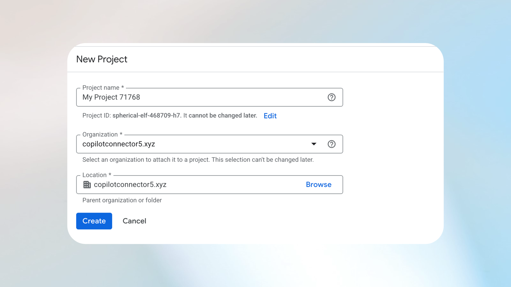

1. Note the **Project ID** for later use.

    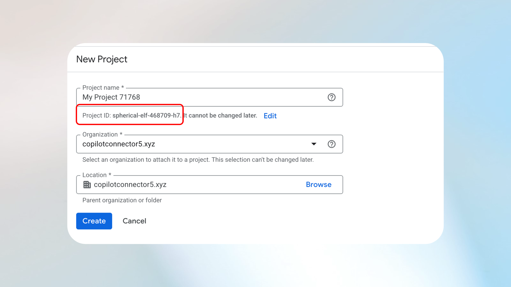

1. Select **Create**.

## Enable required APIs

Enable the following APIs in your Google Cloud project:

- [Admin SDK API](https://console.developers.google.com/apis/api/admin.googleapis.com/overview?project=[PROJECT_ID])
- [Drive API](https://console.developers.google.com/apis/api/drive.googleapis.com/overview?project=[PROJECT_ID])

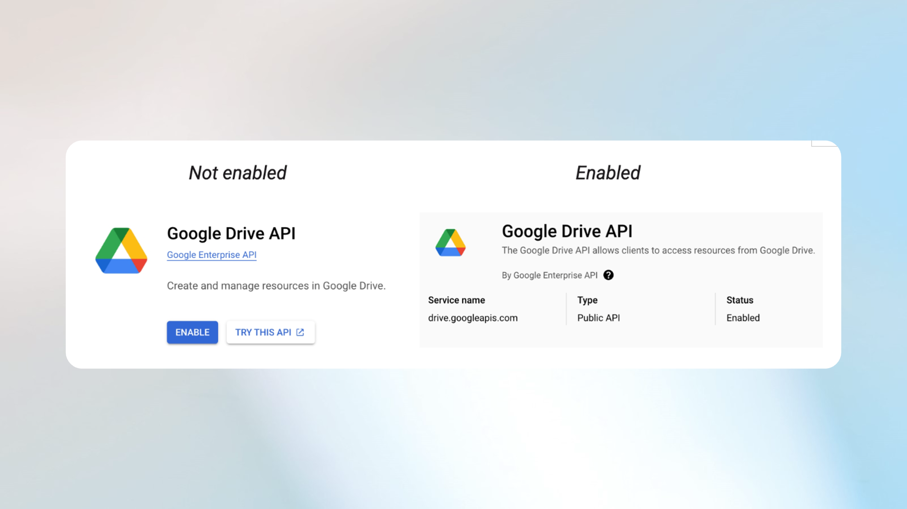 

## Create a Google Cloud service account

To create a Google Cloud service account:

1. Go to the [Service Accounts](https://console.cloud.google.com/projectselector2/iam-admin/serviceaccounts?inv=1&invt=Absc-w&supportedpurview=project) page.

    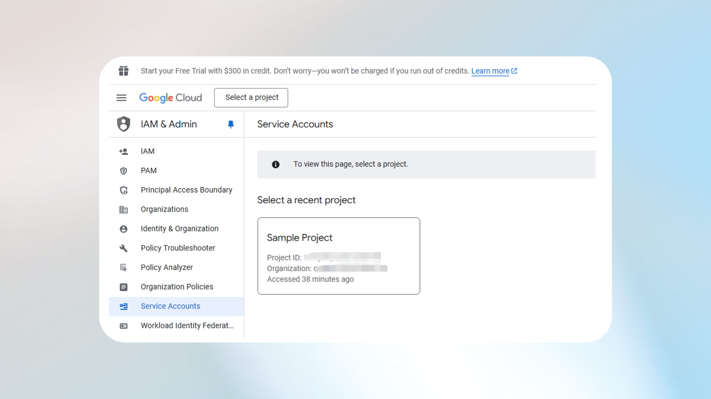

1. Select your project.
1. Select **Create Service Account**.

    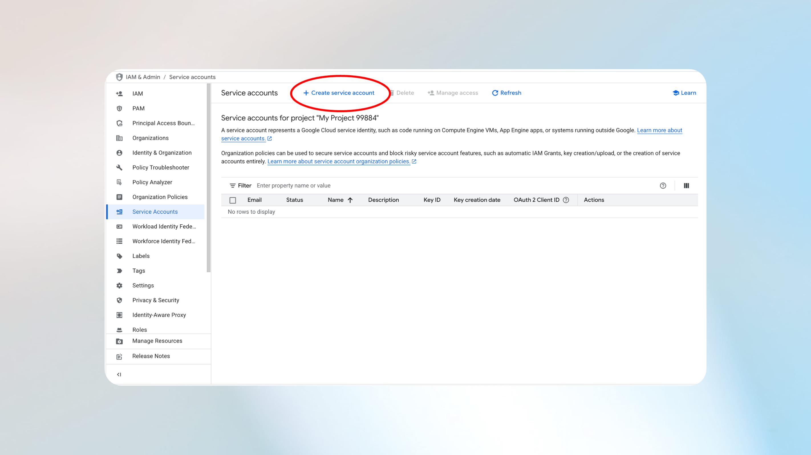 

1. Enter a name, ID, and optional description.
1. Select **Create and Continue**.

    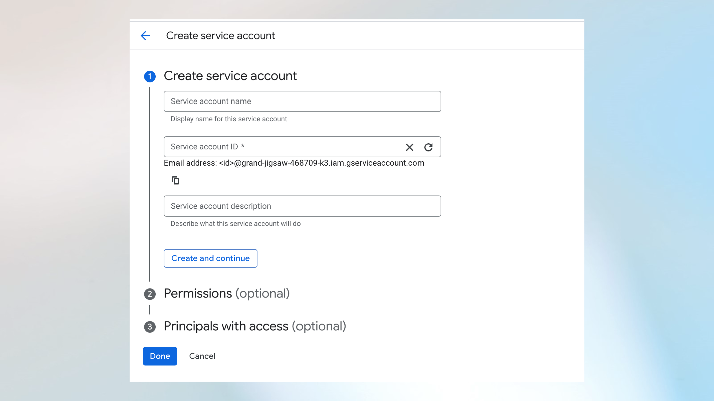

1. Skip **Permissions** and **Principals with access**, and then select **Done**.
1. On the Service Accounts page, select the three-dot menu under **Actions** and select **Manage Keys**.

    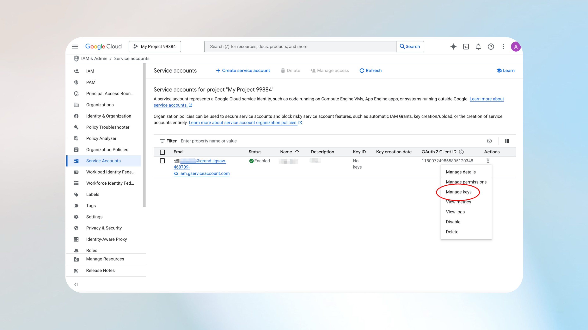   

1. Select **Add Key** > **Create New Key**.
1. Choose **JSON** as the key type and select **Create**.

    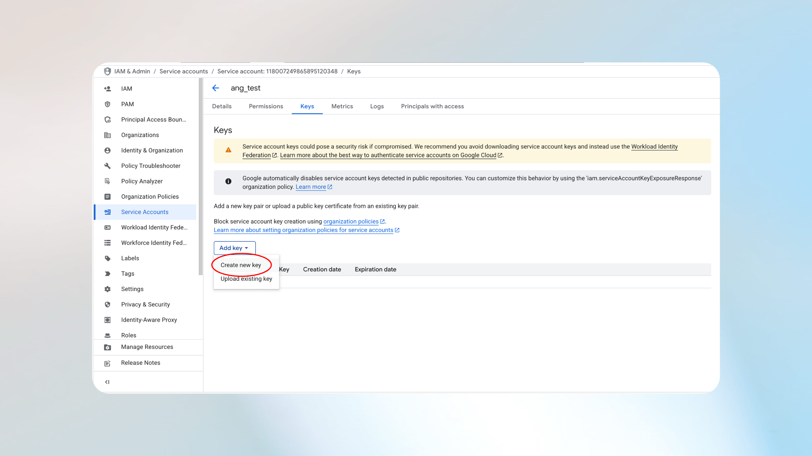  

1. A private JSON key is downloaded to your computer.

    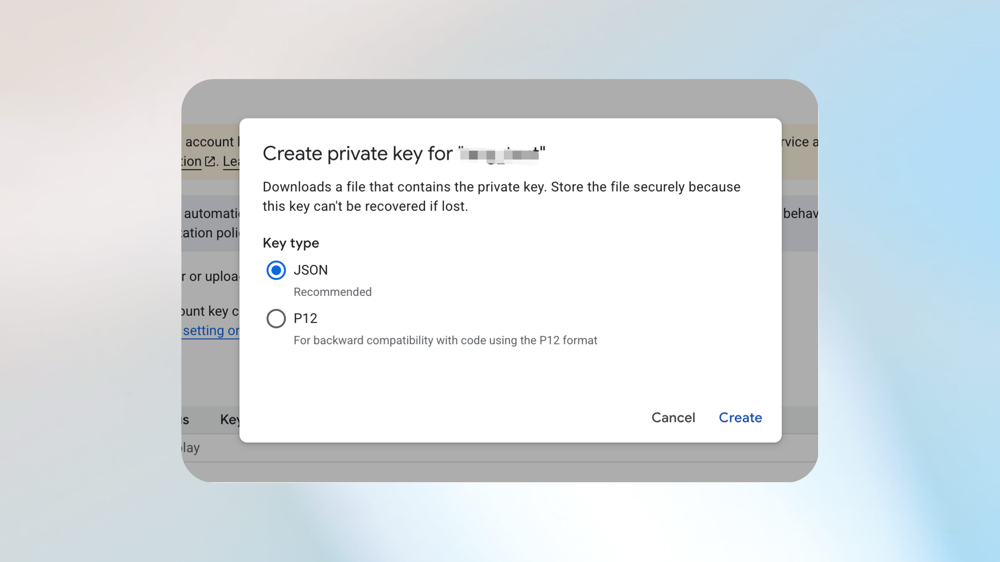

## Add OAuth scopes to your service account

To add OAuth scopes to your service account:

1. Go to the [Google Admin console](https://admin.google.com/ac/home?hl=en).
1. Go to **Security** > **Access and data control** > **API controls**.

    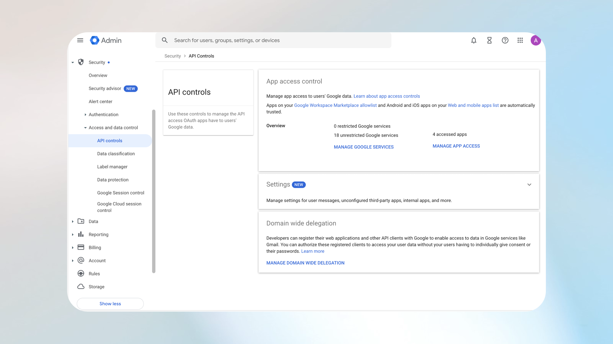

1. Select **Manage Domain Wide Delegation**.

    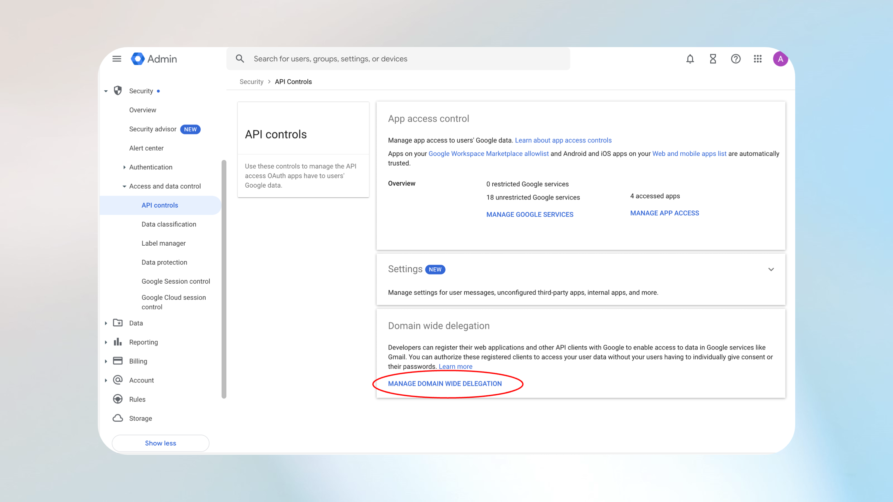

1. Select **Add new** and enter the following OAuth scopes:

    - `https://www.googleapis.com/auth/admin.directory.user.readonly`
    - `https://www.googleapis.com/auth/admin.directory.group.readonly`
    - `https://www.googleapis.com/auth/drive.readonly`
    - `https://www.googleapis.com/auth/admin.reports.audit.readonly`

    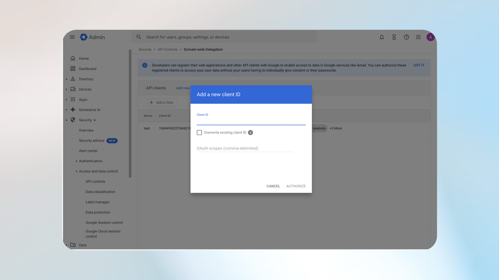

## Get the OAuth 2.0 client ID

To get the client ID:

1. Sign in to the [Google Cloud Platform](https://console.cloud.google.com/iam-admin/serviceaccounts?inv=1&invt=AbtJpg&project=sample-project-454709).
1. Select your service account.
1. Copy the **OAuth 2.0 Client ID**.

## Authentication in Microsoft 365

Provide the following information to the admin to authenticate the connector during the admin center setup process:

- Google Workspace domain  
- Admin email  
- JSON private key  

## Next step

> [!div class="nextstepaction"]
> [Deploy the Google Drive connector](google-drive-deployment.md)
