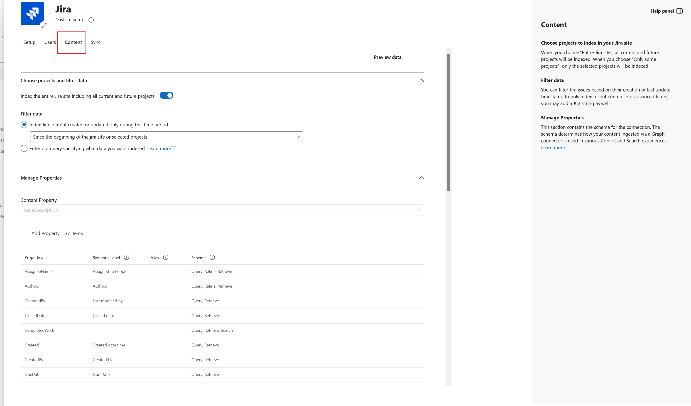
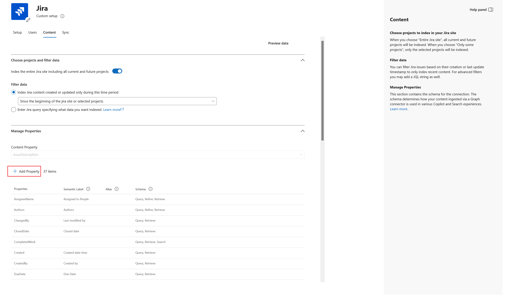
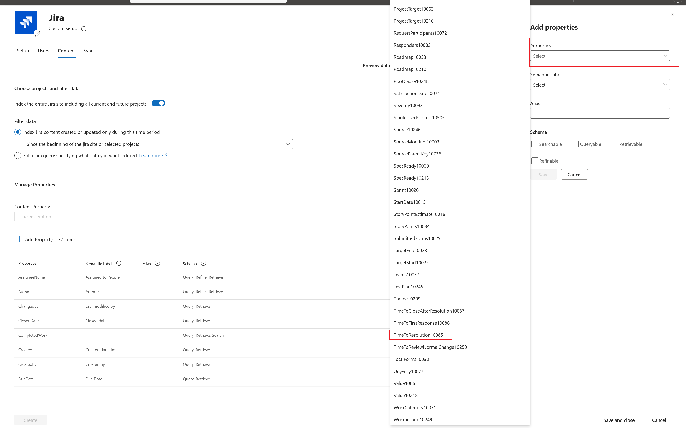
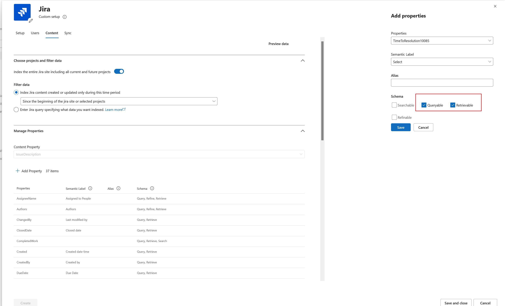
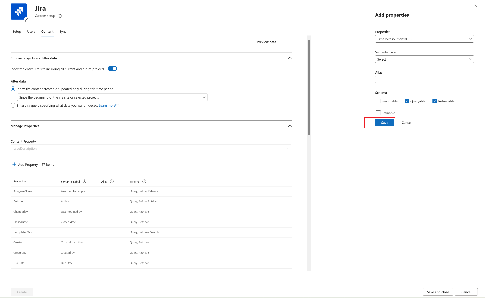

# Deploy the Jira Data Center connector

The Jira Data Center Microsoft 365 Copilot connector allows your organization to index Jira Data Center issues and related project data so they become discoverable and actionable in Microsoft 365 and Microsoft Search experiences. This article describes the steps to deploy and customize the Jira Data Center connector.

## Prerequisites

Before you deploy the connector, make sure that you meet the following prerequisites:

- You must be a Microsoft 365 admin.
- Install the [Microsoft Graph connector agent](/microsoft-365/copilot/connectors/connector-agent) on a Windows computer within the same network as your Jira Data Center instance. If the agent is already installed, verify that you're running version **3.1.15.0 or later**.
- Install the Jira Data Center plugin from the Microsoft 365 Copilot connector listing in the [Atlassian Marketplace](https://marketplace.atlassian.com/).  
  > [!NOTE]
  > The plugin supports Jira Data Center versions **8.10.0 – 10.5.1**.
- Configure a service account with the permissions listed in the following table.

    | Permission name | Permission type | Required for |
    |-----------------|------------------|--------------|
    | **Browse projects** | Project permission | Crawling Jira issues (mandatory). |
    | **Issue level security** | Issue-level security | Crawling issue types with security levels (optional). |
    | **Browse users and groups** | Global permission | Security trimming when **Only people with access to this data source** is selected (optional). |
    | **Administer Jira** | Global permission | Required when enforcing strict access-control mapping (optional). |

- Allow unlimited requests to prevent throttling. In **System** > **Rate limiting** > **Exemptions** > **Add exemptions**, add the service account to the **exemptions** list.

   :::image type="content" alt-text="Screenshot that shows allowing unlimited requests for the Service Account" source="media/jira-data-center/jira-data-center-graph-connector-allow-unlimited-requests-for-service-account.png" lightbox="media/jira-data-center/jira-data-center-graph-connector-allow-unlimited-requests-for-service-account.png":::

  > [!IMPORTANT]
  > The connector generates a significant number of API calls during crawls. Exempt the service account from rate limiting entirely. If you must enforce rate limits, configure them on a **per-minute** or **per-hour** basis - don't use per-second limits. Per-second rate limiting can cause partial crawl failures where some issues are skipped and not indexed.

## Deploy the connector

To add the Jira Data Center connector for your organization:

1. In the **Microsoft 365 admin center**, in the left pane, choose **Copilot** > **Connectors**.
2. Choose the **Gallery** tab.
3. From the list of available connectors, choose **Jira Data Center**.

### Set display name

The display name identifies the content source in Copilot responses. You can accept the default **Jira Data Center** name or customize it to help users recognize the data source.

For more information about connector display names and descriptions, see [Enhance Copilot discovery of connector content](enhance-copilot-discovery.md).

### Set instance URL

Enter the URL of your Jira Data Center instance. The typical format is: `https://jira.<your-domain>.com`.

### Choose authentication type

Configure OAuth 2.0 authentication by using Jira Application Links.

To configure OAuth in Jira:

1. Sign in to Jira Data Center.
2. Go to **Settings** > **Applications** > **Application links**.

    :::image type="content" alt-text="Screenshot of Click Application in Settings menu." source="media/jira-data-center/jira-step2-1-click-application.png" lightbox="media/jira-data-center/jira-step2-1-click-application.png":::

    :::image type="content" alt-text="Screenshot of Application links page." source="media/jira-data-center/jira-step2-2-app-links-page.png" lightbox="media/jira-data-center/jira-step2-2-app-links-page.png":::

1. Select **Create link**.

    :::image type="content" alt-text="Screenshot of Select Create link." source="media/jira-data-center/jira-step3-create-link.png" lightbox="media/jira-data-center/jira-step3-create-link.png":::

1. Choose **External application**, then choose **Incoming** as the direction.

    :::image type="content" alt-text="Screenshot of Select External application and Incoming direction." source="media/jira-data-center/jira-step4-external-incoming.png" lightbox="media/jira-data-center/jira-step4-external-incoming.png":::

1. Complete the **Configure an incoming link** form:
   - **Redirect URL:**  
     - Microsoft 365 Enterprise: `https://gcs.office.com/v1.0/admin/oauth/callback`
     - Microsoft 365 Government: `https://gcsgcc.office.com/v1.0/admin/oauth/callback`
     - Microsoft 365 GCC High (Government Community Cloud High): `https://gcs.office365.us/v1.0/admin/oauth/callback`
     - Microsoft 365 DoD (Department of Defense): `https://gcs-dod.office365.us/v1.0/admin/oauth/callback`
   - **Scope:** Admin

    :::image type="content" alt-text="Screenshot of Configure an incoming link form." source="media/jira-data-center/jira-step5-config-form.png" lightbox="media/jira-data-center/jira-step5-config-form.png":::

1. Copy the **client ID** and **secret**, and paste them into the Microsoft 365 admin center connection setup page.

    :::image type="content" alt-text="Screenshot of Client ID and Secret." source="media/jira-data-center/jira-step6-credentials.png" lightbox="media/jira-data-center/jira-step6-credentials.png":::

### Roll out

To validate the connection before a full rollout, select **Rollout to limited audience** and specify the users or groups for the staged deployment. For more information, see [Staged rollout for Copilot connectors](staged-rollout.md).

Choose **Create** to deploy the connector. The Jira Data Center connector starts indexing content right away.

The following table lists the default values that the connector applies.

| Category | Default value |
|----------|----------------|
| **Users** | Access permissions: Only people with access to this data source; identities mapped using Microsoft Entra ID. |
| **Content** | All projects indexed by default; default property schema applied. |
| **Sync** | Incremental crawl every 15 minutes; full crawl daily. |

To customize these values, choose **Custom setup**. For more information, see [Customize settings](#customize-settings-optional).

After you create your connection, you can review the status in the **Connectors** section of the [Microsoft 365 admin center](https://admin.microsoft.com/).

## Customize settings (optional)

You can customize settings for the Jira Data Center connector.

### Customize user settings

#### Access permissions

The connector supports two access options:

- **Everyone**
- **Only people with access to this data source** (recommended)

When you select **Only people with access to this data source**, the connector enforces the Jira permission model, including issue-level security and project permissions. Identity mapping is required if Jira email IDs differ from Microsoft Entra ID user principal name (UPN) values.

The connector uses the following hierarchy:
1. **Issue security level (Highest priority):** If set, access is restricted to users in that level.
2. **Fallback to project-level permissions:** If no security level is set, access is determined by the **Browse Projects** permission.

#### Map identities

If you use restrictive permissions, map Jira identities to Microsoft 365 identities in one of the following ways:

- **Microsoft Entra ID:** Choose this option if the email ID of Jira users is the same as the UPN in Microsoft Entra ID.
- **Non-Entra ID:** Choose this option if the IDs differ (requires a Regex rule).

### Customize content settings

#### Filter data

You can filter issues by creation or update timestamp, or by using **JQL** (Jira Query Language).

##### JQL configuration guidelines

When configuring a JQL filter for the connector, follow these rules:

- **Don't add a project filter.** If you need to filter by project, use the **Project filter** option in the connector configuration instead.
- **Don't add an `ORDER BY` clause.** The connector manages result ordering internally. Adding a sort clause can interfere with pagination and crawl performance.
- **Only include issue-level filter conditions.** The JQL should contain conditions that filter issues based on their properties, such as status, type, priority, labels, resolution, or custom fields.

##### JQL examples

| Scenario | JQL |
|---|---|
| Only index unresolved issues | `resolution = Unresolved` |
| Exclude subtasks | `issuetype not in subtaskIssueTypes()` |
| Only index bugs and tasks | `issuetype in (Bug, Task)` |
| Filter by priority | `priority in (High, Highest)` |
| Filter by label | `labels = "customer-facing"` |
| Exclude issues in a specific status | `status != Closed` |
| Only index issues updated in the last 90 days | `updated >= -90d` |
| Combine multiple conditions | `issuetype in (Bug, Story) AND priority in (High, Highest) AND resolution = Unresolved` |

> [!IMPORTANT]
> Don't use `project = "PROJ"` in the JQL field. Use the dedicated **Project filter** setting to scope by project. Don't add `ORDER BY` clauses - the connector handles ordering automatically.

#### Manage properties

Select the Jira fields (schema properties) you want to index. Include built-in Jira fields or add custom fields. For more information, see [Manage search schema](/microsoftsearch/manage-search-schema). The following properties are indexed by default.

|Source property       | Semantic Label          | Schema  |
|:---------------------|:---------------------- |:---------------------- |
| AssigneeEmailId       |                         | Query, Retrieve, Search |
| AssigneeName          |                         | Query, Retrieve, Search |
| Authors               | Authors               | Query, Retrieve       |
| Created               | Created date time       | Retrieve              |
| DueDate               |                         | Retrieve              |
| IssueDescription      |                         | Search                |
| IssueIconUrl          | IconUrl                  | Retrieve                |
| IssueId               |                         | Retrieve              |
| IssueKey              |                         | Query, Retrieve, Search|
| IssueLink             | Url                     | Query, Retrieve, Search|
| IssuePriority         |                         | Query, Retrieve, Search |
| IssueStatus           |                         | Query, Retrieve  |
| IssueSummary          |                         | Search |
| IssueType             |                         | Query, Retrieve |
| Labels                |                         | Query, Retrieve |
| ProjectName           |                         | Query, Retrieve  |
| ReporterEmailId       | Created by              | Query, Retrieve, Search  |
| ReporterName          |                         | Query, Retrieve, Search |
| Title                 | Title                   | Query, Retrieve, Search  |
| Updated               | Last modified date time | Query, Retrieve |

The Jira Data Center Copilot connector also supports the following custom fields.

| Custom field | Attributes (recommended) | Earliest supported GCA version |
| :--- | :--- | :--- |
| Sprint | Query, Retrieve, Refine (optional) | 3.1.23.0 |
| Fix Version | Query, Retrieve | 3.1.23.0 |
| Customer Name/s | Query, Retrieve | 4.0.0.0 |
| Support Owner | Query, Retrieve | 4.0.0.0 |
| Affects Version/s | Query, Retrieve | 4.0.0.0 |
| SLA | Query, Retrieve | 4.0.0.0 |
| Time to resolution | Query, Retrieve | 4.0.0.0 |
| Region | Query, Retrieve | 4.0.0.0 |
| First Response | Query, Retrieve | 4.0.0.0 |
| Request Type | Query, Retrieve | 4.0.0.0 |
| Approver | Query, Retrieve | 4.0.0.0 |
| Resolution | Query, Retrieve | 4.0.3.0 |

> [!NOTE]
> *   The Jira Data Center Copilot connector can index both default issue fields and custom-created issue fields.
> *   If a selected custom-created field isn't present in some Jira issue types, the connector ingests the field as NULL (blank).
> *   The list of properties that you select affects how users can filter, search, and view results in Copilot.

#### Add custom properties

To add custom properties to the Jira Data Center Copilot connector:

1. Select the **Content** tab to open the content and property settings.

   

2. In the properties section, select **Add property**.

   

3. From the list of available fields, select the field that you want to add.

   

4. Select the schema options for the field. These options determine whether the field is searchable, queryable, retrievable, or refinable.

   

5. Review the property configuration, and then select **Save**.

   

#### Manage customized properties

To manage customized properties, ensure the following conditions are met:

1.  **Name** isn't empty and isn't composed only of whitespace.
2.  **Key** isn't empty and contains an underscore ("_").
3.  **Data type** is supported:
    - **Non-array types**: string, date, datetime, number, option
    - **Array types**: string, option, user
4.  **Name** doesn't start with "label_" or "Refinable" (reserved system prefixes).
5.  **Name** length is 26 characters or fewer.
6.  **Name** contains only letters and numbers (no special characters).

Users can access `https://jira.<your-domain>.com/rest/api/2/field` and review the returned data.

### Customize sync intervals

You can adjust the crawl frequency to fit your data refresh needs. The following are the default values:

- **Full crawl:** Every day  
- **Incremental crawl:** Every 15 minutes

For more information, see [Guidelines for crawl settings](deployment-overview.md#guidelines-for-crawl-settings).

## Related content

- [Jira Data Center connector overview](jira-data-center-overview.md)
- [Troubleshoot issues with the Jira Data Center connector](jira-data-center-troubleshooting.md)
- [Jira result layout](jira-result-layout.md)
- [Set up Copilot connectors in the Microsoft 365 admin center](/microsoft-365/copilot/connectors/deployment-overview)
