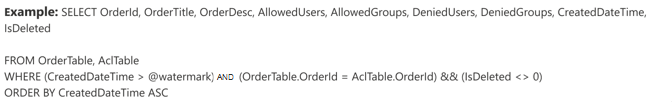
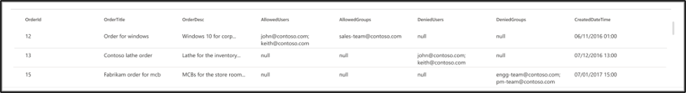
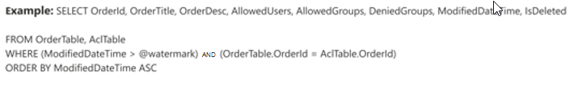
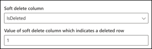
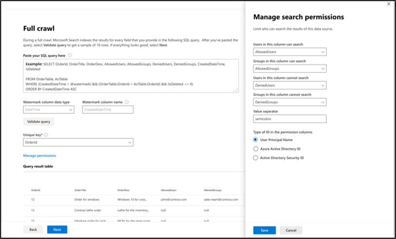

# Azure SQL and Microsoft SQL Server connectors

By using the Microsoft SQL Server or Azure SQL Microsoft 365 Copilot connectors, your organization can discover and index data from an on-premises SQL Server database or a database hosted in your Azure SQL instance in the cloud.
The connector indexes specified content in Microsoft Search and Microsoft 365 Copilot. To keep the index up to date with source data, it supports periodic full and incremental crawls. By using these SQL connectors, you can also restrict access to search results for certain users.

## Capabilities
- Index records from your MS SQL server or Azure SQL database by using a SQL query.
- Specify access permissions for every record with a list of users or groups added in the SQL query.
- Enable your end users to ask questions related to indexed records in Copilot.
- Use [Semantic search in Copilot](/microsoftsearch/semantic-index-for-copilot) to enable users to find relevant content based on keywords, personal preferences, and social connections.

## Limitations
- Microsoft SQL Server Copilot connector: The on-premises database must run SQL Server version 2008 or later.
- Azure SQL Copilot connector: The Microsoft 365 subscription and Azure subscription (hosting Azure SQL database) must lie within the same Microsoft Entra ID. Cross-tenant data flow isn't supported.
- To support high crawl speed and better performance, the connector supports only OLTP (Online Transaction Processing) workloads. OLAP (Online Analytical Processing) workloads that don't execute the provided SQL query within a 40-second timeout aren't supported.
- ACLs support only User Principal Name (UPN), Microsoft Entra ID, or Active Directory Security.
- Indexing rich content inside database columns isn't supported. Examples of such content are HTML, JSON, XML, blobs, and document parsings that exist as links inside the database columns.

## Prerequisites
- You must be the **AI administrator** for your organization's Microsoft 365 tenant.
- **Install the Microsoft Graph connector agent** (only applicable for MS SQL Copilot connector): To access your Microsoft SQL Server, you must install and configure the connector agent. See [Install the Microsoft Graph connector agent](connector-agent.md) to learn more.
- **Service Account**: To connect to your SQL database and allow the Copilot connector to update records regularly, you need a service account with read permissions granted to the service account.

>[!NOTE]
>If you use Windows authentication while configuring the Microsoft SQL Server connector, the user with which you're trying to sign in needs to have interactive sign-in rights to the machine where the connector agent is installed. For more information, see [login policy management](/windows/security/threat-protection/security-policy-settings/allow-log-on-locally#policy-management).

## Get Started with Setup

### 1. Display name 
The display name identifies each citation in Copilot, so users can easily recognize the associated file or item. The display name also signifies trusted content, and acts as a [content source filter](/microsoftsearch/custom-filters#content-source-fource-filters). A default value is present for this field, but you can customize it to a name that users in your organization recognize.

### 2. SQL server
To connect to your SQL data, you need your SQL server address and database name.

### 3. Authentication Type
The Azure SQL Copilot connector only supports Microsoft Entra ID OpenID Connect (OIDC) authentication to connect to the database.

**Register an app (for the Azure SQL Copilot connector only)**

For the Azure SQL Copilot connector, you must register an app in Microsoft Entra ID to allow the Microsoft Search app and Microsoft 365 Copilot to access data for indexing. To learn more about registering an app, see the Microsoft Graph documentation on how to [register an app](/graph/auth-register-app-v2).

After completing the app registration and taking note of the app name, application (client) ID, and tenant ID, [generate a new client secret](/azure/healthcare-apis/register-confidential-azure-ad-client-app#application-secret). The client secret is only displayed once. Remember to note and store the client secret securely. Use the client ID and client secret while configuring a new connection in Microsoft Search and Microsoft 365 Copilot.

To add the registered app to your Azure SQL Database, you need to:

1. Sign in to your Azure SQL DB.
1. Open a new query window.
1. Create a new user by running the command `CREATE USER [app name] FROM EXTERNAL PROVIDER`.
1. Add the user to the role by running the command `exec sp_addrolemember 'db_datareader', [app name]` or `ALTER ROLE db_datareader ADD MEMBER [app name]`.

To learn more about revoking access to any app registered in Microsoft Entra ID, see [removing a registered app](/azure/active-directory/develop/quickstart-remove-app).

**Firewall settings (for the Azure SQL Copilot connector only)**

For added security, you can configure IP firewall rules for your Azure SQL Server or database. To learn more about setting up IP firewall rules, see the documentation on [IP firewall rules](/azure/azure-sql/database/firewall-configure). Add the following client IP ranges in the firewall settings.

| Region | Microsoft 365 Enterprise | Microsoft 365 Government
| ------------ | ------------ | ------------ |
| NAM | 52.250.92.252/30, 52.224.250.216/30 | 52.245.230.216/30, 20.141.117.64/30|
| EUR | 20.54.41.208/30, 51.105.159.88/30 | NA|
| APC | 52.139.188.212/30, 20.43.146.44/30 | NA|

### 4. Roll out to limited audience
Deploy this connection to a limited user base if you want to validate it in Copilot and other Search surfaces before expanding the roll-out to a broader audience. To learn more about limited rollout, [see staged rollout](staged-rollout.md).

## Content
To search your database content, you must specify SQL queries when you configure the connector. These SQL queries need to name all the database columns that you want to index (source properties). This requirement includes any SQL joins that you need to perform to get all the columns. To restrict access to search results, you must specify Access Control Lists (ACLs) within SQL queries when you configure the connector.

### 1. Full crawl (Required)

a. **Select data columns (Required) and ACL columns (Optional)**  

[Click to expand] Selecting data columns for full crawl query.
 

In this step, you configure the SQL query that runs a full crawl of the database. The full crawl selects all the columns or properties that need to be presented in Microsoft 365 Copilot or Search. You can also specify ACL columns to restrict access to search results to specific users or groups.

> [!Tip]
> To get all the columns that you need, you can join multiple tables.

The example demonstrates a selection of five data columns that hold the data for the search: OrderId, OrderTitle, OrderDesc, CreatedDateTime, and IsDeleted. To set view permissions for each row of data, you can optionally select these ACL columns: AllowedUsers, AllowedGroups, DeniedUsers, and DeniedGroups. All these data columns also have the options to **Query**, **Search**, **Retrieve**, or **Refine**.

Select data columns as shown in this example query: 
 `SELECT orderId, orderTitle, orderDesc, allowedUsers, allowedGroups, deniedUsers, deniedGroups, createdDateTime, isDeleted`

The SQL Copilot connectors don't allow column names with nonalphanumeric characters in the SELECT clause. Remove any nonalphanumeric characters from column names using an alias. Example - SELECT *column_name* AS *columnName*

To manage access to the search results, you can specify one or more ACL columns in the query. The SQL Copilot connector allows you to control access at per per-record level. You can choose to have the same access control for all records in a table. If the ACL information is stored in a separate table, you might have to do a join with those tables in your query.

The use of each of the ACL columns in the above query is described below. The following list explains the four **access control mechanisms**.

- **AllowedUsers**: This column specifies the list of user IDs who can access the search results. In the following example, a list of users: john@contoso.com, keith@contoso.com, and lisa@contoso.com would only have access to a record with OrderId = 12.
- **AllowedGroups**: This column specifies the group of users who will be able to access the search results. In the following example, group sales-team@contoso.com would only have access to the record with OrderId = 12.
- **DeniedUsers**: This column specifies the list of users who do **not** have access to the search results. In the following example, users john@contoso.com and keith@contoso.com don't have access to the record with OrderId = 13, whereas everyone else has access to this record.
- **DeniedGroups**: This column specifies the group of users who do **not** have access to the search results. In the following example, groups engg-team@contoso.com and pm-team@contoso.com don't have access to a record with OrderId = 15, whereas everyone else has access to this record.  

b. **Supported data types**  

[Click to expand] List of supported data types.
 

The table summarizes the SQL data types that are supported in the MS SQL and Azure SQL Copilot connectors. The table also summarizes the indexing data type for the supported SQL data type. To learn more about Microsoft 365 Copilot connectors supported data types for indexing, refer to the documentation on [property resource types](/graph/api/resources/externalconnectors-externalconnection).

| Category | Source data type | Indexing data type |
| ------------ | ------------ | ------------ |
| Date and time | date   datetime   datetime2   smalldatetime | datetime |
| Exact numeric | bigint   int   smallint   tinyint | int64 |
| Exact numeric | bit | boolean |
| Approximate numeric | float   real | double |
| Character string | char   varchar   text | string |
| Unicode character strings | nchar   nvarchar   ntext | string |
| String collection | char   varchar   text | stringcollection* |
| Other data types | uniqueidentifier | string |

*To index a column as a string collection, you need to cast a string to the string collection type. This can be done by clicking the 'Edit datatypes' link in Full crawl settings and selecting the appropriate columns as StringCollection, along with specifying a delimiter to split the string.

For any other data type currently not directly supported, the column needs to be explicitly cast to a supported data type.

c. **Watermark (Required)**  

[Click to expand] Specifying the watermark column in full crawl query
 

To prevent overloading the database, the connector batches and resumes full-crawl queries by using a full-crawl watermark column. The connector uses the value of the watermark column to fetch each subsequent batch and resume querying from the last checkpoint. This mechanism controls data refresh for full crawls.

Create query snippets for watermarks as shown in these examples:

- `WHERE (CreatedDateTime > @watermark)`. Use the reserved keyword `@watermark` to cite the watermark column name. If the sort order of the watermark column is ascending, use `>`; otherwise, use `<`.
- `ORDER BY CreatedDateTime ASC`. Sort on the watermark column in ascending or descending order.

In the configuration shown in the following image, `CreatedDateTime` is the selected watermark column. To fetch the first batch of rows, specify the data type of the watermark column. In this case, the data type is `DateTime`.

The first query fetches the first **N** number of rows by using: "CreatedDateTime > January 1, 1753 00:00:00" (min value of DateTime data type). After the first batch is fetched, the highest value of `CreatedDateTime` returned in the batch is saved as the checkpoint if the rows are sorted in ascending order. An example is March 1, 2019, 03:00:00. Then the next batch of **N** rows is fetched by using "CreatedDateTime > March 1, 2019 03:00:00" in the query.

### 2. Manage properties

The SQL connector picks up all columns specified in the full crawl SQL query as source properties for ingestion. In this step, you define the search schema for your content. This step involves defining the search annotations like search, retrieve, query, and refine, for selected source properties. This step also includes assigning semantic labels and aliases to enhance search relevance. To learn more about search schema, see the documentation on [guidelines for 'manage properties'](/microsoft-365/copilot/connectors/deployment-overview#guidelines-for-manage-properties).

### 3. Incremental crawl (optional)

a. **Incremental sync query**  

In this optional step, provide a SQL query to run an incremental crawl of the database. With this query, the SQL connector determines any changes to the data since the last incremental crawl. As in the full crawl, select all columns where you want to select the options **Query**, **Search**, **Retrieve**, or **Refine**. Specify the same set of ACL columns that you specified in the full crawl query.

The components in the following image resemble the full crawl components with one exception. In this case, "ModifiedDateTime" is the selected watermark column. Review the full crawl steps to learn how to write your incremental crawl query and see the following image as an example.

b. **Soft delete instructions (Optional)**

In a SQL record system, a soft delete is a technique where, instead of physically removing a record from a database, you mark it as "deleted" by setting a specific flag or column. This technique allows the record to remain in the database, but it's logically excluded from most operations. To delete soft-deleted rows in your database during the incremental crawl, specify the soft-delete column name and value that indicates the row is deleted.

## Users

Use the **Only people with access to this data source** option to restrict access to users or groups as selected in the full crawl query, or override it to make your content visible to **Everyone**.

### 1. Map columns containing access permissions information

Choose the various access control (ACL) columns that specify the access control mechanism. Select the column name you specified in the full crawl SQL query. Note that "deny" takes precedence over "allow" permissions.

Each of the ACL columns is expected to be a multivalued column. These multiple ID values can be separated by separators such as semicolon (;), comma (,), and so on. You need to specify this separator in the **value separator** field.

The following ID types are supported for use as ACLs:

- **User Principal Name (UPN)**: A User Principal Name (UPN) is the name of a system user in an email address format. A UPN (for example: john.doe@domain.com) consists of the username (login name), separator (the @ symbol), and domain name (UPN suffix). Security groups in Microsoft Entra don't have a User Principal Name and can't be mapped with this option.
- **Microsoft Entra ID**: In Microsoft Entra ID, every user or group has an object ID that looks something like `e0d3ad3d-0000-1111-2222-3c5f5c52ab9b`.
- **Active Directory (AD) Security ID**: In an on-premises AD setup, every user and group has an immutable, unique security identifier that looks something like `S-1-5-21-3878594291-2115959936-132693609-65242`.

## Sync
The refresh interval determines how often your data is synced between the data source and the Copilot connector index.

You can configure full and incremental crawls based on the scheduling options present here. By default, incremental crawl (if configured) is set for every 15 minutes, and full crawl is set for every day. If needed, you can adjust these schedules to fit your data refresh needs.

At this point, you're ready to create the connection for Azure SQL or MS SQL. You can select **Create** to publish your connection and index data from your database.

## Troubleshooting
After publishing your connection, review the status in the **Connectors** section of the [admin center](https://admin.microsoft.com). To learn how to make updates and deletions, see [Manage your connector](manage-connector.md).
You can find troubleshooting steps for commonly seen issues [here](troubleshoot-mssql-connector.md).

If you have issues or want to provide feedback, contact [Microsoft Graph | Support](https://developer.microsoft.com/en-us/graph/support).