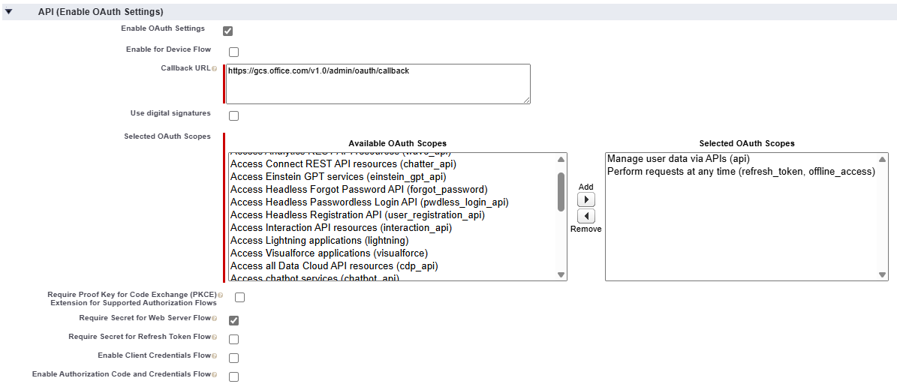
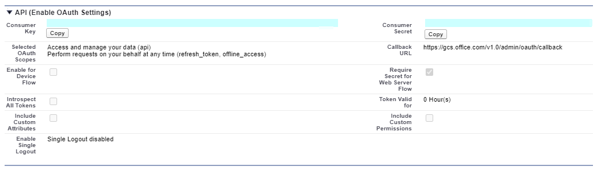
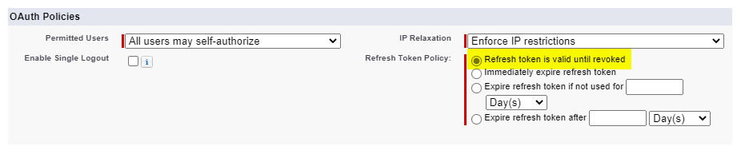
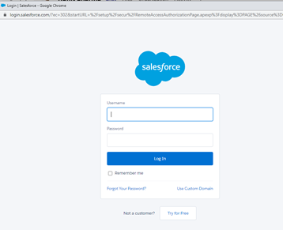
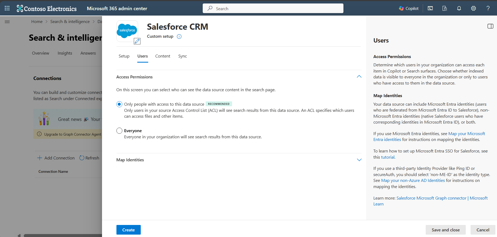
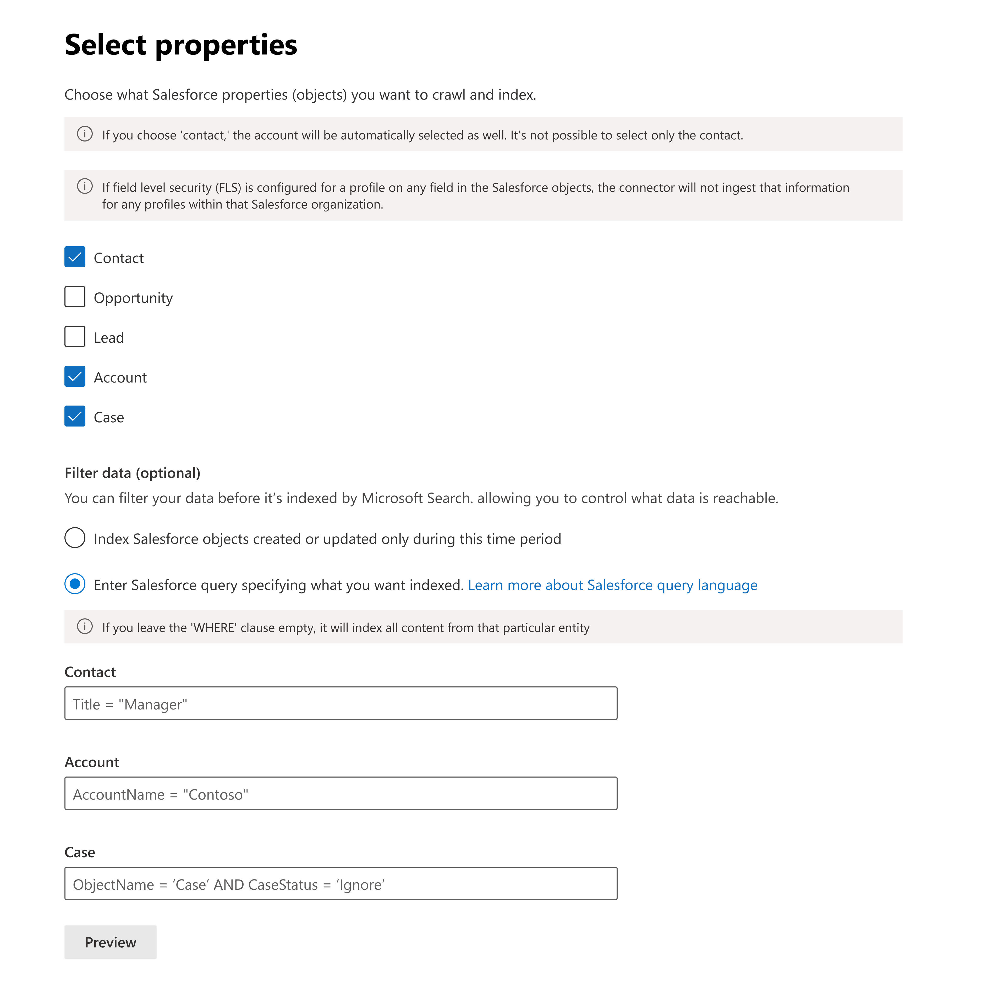

# Salesforce CRM Copilot connector

The Salesforce CRM Microsoft 365 Copilot connector enables your organization to index contacts, opportunities, leads, cases, and accounts objects in your Salesforce instance. After you configure the connector and index content from Salesforce, end users can search for those items from any Microsoft Search and Microsoft 365 Copilot client.

> [!IMPORTANT]
> The Salesforce Copilot connector currently supports Summer 19 and later.

## Capabilities

The connector has the following capabilities:

- Index contacts, opportunities, leads, cases, and accounts objects in your Salesforce instance
- Filter content based on what you want to index  
- Access Salesforce CRM data by using the power of Semantic search
-	Retain ACLs defined by your organization
-	Customize your crawl frequency
- Create agents and workflows by using this connection and plugins from Microsoft Copilot Studio

## Limitations

The connector has the following limitations:

- The connector doesn't honor visibility permissions applied through managed permission sets or permission set groups. This limitation can lead to fields not being indexed or included in search results.
- The Salesforce Copilot connector doesn't currently support Apex-based sharing, territory-based sharing, or sharing by using personal groups from Salesforce.
- There's a known bug in the Salesforce API that the connector uses, where the private org-wide defaults for leads aren't honored.
- If you set field-level security (FLS) for a profile, the connector doesn't ingest that field for any profiles in that Salesforce org. As a result, users can't search for values for those fields or see them in the results.

> [!NOTE]
> When you create a new Salesforce CRM connector, you can opt in to indexing specific FLS-restricted fields on the **Content** tab. Opted-in fields become visible to all Microsoft 365 users who have access to the records of the entity. For more information, see [Include FLS-restricted fields](#include-fls-restricted-fields).

- In the **Manage properties** section, these common standard property names appear once. The options are **Query**, **Search**, **Retrieve**, and **Refine**, and they apply to all or none.
    - Name
    - Url
    - Description
    - Fax
    - Phone
    - MobilePhone
    - Email
    - Type
    - Title
    - AccountId
    - AccountName
    - AccountUrl
    - AccountOwner
    - AccountOwnerUrl
    - Owner
    - OwnerUrl
    - CreatedBy
    - CreatedByUrl
    - LastModifiedBy
    - LastModifiedByUrl
    - LastModifiedDate
    - ObjectName

## Prerequisites

To connect to your Salesforce instance, you need your Salesforce instance URL, the client ID, and the client secret for OAuth authentication. The following steps explain how you or your Salesforce administrator can get this information from your Salesforce account:

1. Sign in to your Salesforce instance and go to **Setup**.

1. Go to **Apps** > **App Manager**.

1. Select **New connected app**.

1. Complete the API section as follows:

    - Select the checkbox for **Enable Oauth settings**.

    - Specify the Callback URL as: For **M365 Enterprise**: `https://gcs.office.com/v1.0/admin/oauth/callback`, for **M365 Government**: `https://gcsgcc.office.com/v1.0/admin/oauth/callback`

    - Select these required OAuth scopes:

        - Access and manage your data (API).

        - Perform requests on your behalf at any time (refresh_token, offline_access).

    - Clear the **Require PKCE Extension** option.

    - Select the checkbox for **Require secret for web server flow**.

    - Save the app.
    
      > [!div class="mx-imgBorder"]
      > 

1. Use this consumer key and secret as the client ID and the client secret when you configure the connection settings for your Salesforce Copilot connector in the Microsoft 365 admin portal. Acquire this information as follows:
    1. Go to **Setup** and go to **Apps** > **App Manager**.
    1. Select the connected app you created in the previous step.
    1. Select **Manage Consumer Details**.
    1. Copy the consumer key and the consumer secret.

      > [!div class="mx-imgBorder"]
      > 
  
1. Before closing your Salesforce instance, follow these steps to ensure that refresh tokens don't expire:
    1. Go to **Apps** > **App Manager**.
    1. Find the app you created and select the drop-down on the right. Select **Manage**.
    1. Select **edit policies**.
    1. For the refresh token policy, select **Refresh token is valid until revoked**.

      > [!div class="mx-imgBorder"]
      > 

You can now use the [Microsoft 365 Admin Center](https://admin.microsoft.com/) to complete the rest of the setup process for your Copilot connector.

## Get started

### 1. Display name

The display name identifies each reference in Copilot, so users can easily recognize the associated file or item. The display name also signifies trusted content and is used as a [content source filter](/microsoftsearch/custom-filters#content-source-filters). A default value is present for this field, but you can customize it to a name that users in your organization recognize.

### 2. Salesforce CRM URL

For the Instance URL, use `https://[domain].my.salesforce.com` where the domain is the Salesforce domain for your organization.

### 3. Authentication type

To authenticate and sync content from Salesforce CRM, select **OAuth 2.0**. Enter the client ID and client secret you got from your Salesforce instance, and select **Authorize**.

The first time you attempt to sign in with these settings, a pop-up prompts you to sign in to Salesforce by using your admin username and password. The following screenshot shows the pop-up. Enter your credentials and select **Log In**.

  

  > [!NOTE]
  >
  > - If the pop-up doesn't appear, your browser might block it. To fix this problem, allow pop-ups and redirects.
  > - Make sure that the Salesforce account you use to sign in for the connector is the same as the user already signed in to Salesforce.
  > - Make sure that the user signing in has all the necessary object permissions for the organization.

Verify that the connection was successful by looking for a green check mark that shows correct credentials.

### 4. Roll out to limited audience

Deploy this connection to a limited user base if you want to validate it in Copilot and other Search surfaces before expanding the rollout to a broader audience. To know more about limited rollout, see [staged rollout](staged-rollout.md).

At this point, you're ready to create the connection for Salesforce CRM. You can click **Create** to publish your connection and index content from your Salesforce instance.

For other settings, like **Access Permissions**, **Data Inclusion Rules**, **Schema**, **Crawl frequency**, we have defaults based on what works best with Salesforce data. You can see the default values below:

| Users | Description |
|----|---|
| Access permissions | Only people with access to content in Data source. |
| Map Identities | Data source identities mapped using Microsoft Entra IDs. |

| Content | Description |
|---|---|
| Salesforce objects | All objects are indexed. |
| Filter data | All objects are indexed. No time filter or [SOQL](https://developer.salesforce.com/docs/atlas.en-us.soql_sosl.meta/soql_sosl/sforce_api_calls_soql_select_conditionexpression.htm) criteria is applied. |
| Manage Properties | To check default properties and their schema, see [content](#content). |

| Sync | Description |
|---|---|
| Incremental Crawl | Frequency: Every 15 mins |
| Full Crawl | Frequency: Every Day |

If you want to change any of these values, select the **Custom Setup** option.

## Custom setup

Custom setup is for admins who want to change the default values for the settings listed in the preceding table. When you select **Custom Setup**, you see three more tabs - Users, Content, and Sync.

### Users

**Access permissions**

The Salesforce CRM connector supports search permissions visible to **Everyone** or **Only people with access to this data source**. If you choose **Everyone**, indexed data appears in the search results for all users. If you choose **Only people with access to this data source**, indexed data appears in the search results for users who have access to them. Choose the option that is most appropriate for your organization.

**Map identities**

You can choose to ingest access control lists (ACLs) from your Salesforce instance or allow everyone in your organization to see search results from this data source. ACLs can include Microsoft Entra identities (users who are federated from Entra ID to Salesforce), non-Entra ID identities (Salesforce users who have corresponding identities in Entra ID), or both.

> [!NOTE]
> If you use a third-party Identity Provider like Ping ID or secureAuth, select **non-Microsoft Entra** as the identity type.

If you choose to ingest an ACL from your Salesforce instance and select **non-ME ID** for the identity type, see [Map your non-Microsoft Entra Identities](map-non-entra-id.md) for instructions on mapping the identities.

If you choose to ingest an ACL from your Salesforce instance and select **ME-ID** for the identity type, see [Map your Microsoft Entra Identities](map-entra-id.md) for instructions on mapping the identities. To learn how to set up Entra SSO for Salesforce, see this [tutorial](/azure/active-directory/saas-apps/salesforce-tutorial).

> [!NOTE]
> Updates to groups governing access permissions sync in full crawls only. Incremental crawls don't support processing of updates to permissions.

### Content

**Choose Salesforce objects and filter data**

Select the Salesforce objects that you want the connector to crawl and include in search results. If you select Contact, Account is automatically selected as well.

### Include FLS-restricted fields

Salesforce field-level security (FLS) hides specific fields from selected profiles or permission sets. The connector detects these fields in your selected entities and excludes them from the crawl by default. On the **Content** tab, you can opt in to indexing specific fields. Coordinate with your Salesforce admin first; for the Salesforce-side preparation, see [Verify field-level security (FLS) settings](salesforce-crm-admin-setup.md#verify-field-level-security-fls-settings).

When the connector finds FLS-restricted fields, a banner appears at the top of the **Content** tab with the affected counts and a summary pill (for example, **0 of 6 FLS fields included**). Select **Show FLS Fields** to expand the **Field-Level Security Review** panel.

The panel groups fields by entity. Expand an entity, then for each field:

- **Field Name** - the API name of the field in Salesforce.
- **Restricted Permission Sets** - the Salesforce profiles or permission sets restricted from the field.
- **Include in Crawl** - switch the toggle to **Yes** to index the field. Use **Select All** to include every FLS field in an entity at once.

Opted-in fields appear in the **Manage properties** table with an **FLS** badge. Excluded FLS fields don't appear there.

> [!WARNING]
> When you set **Include in Crawl** to **Yes**, the field is indexed for all Microsoft 365 users who have access to the records of the entity, regardless of the Salesforce FLS restrictions. Only opt in after your Salesforce admin confirms the field is safe to share broadly in Microsoft Search and Microsoft 365 Copilot.

**Filter data**

   You can filter the Salesforce content that is indexed in two ways:

   * Specify the item **modified time period**. This option only indexes the Salesforce content that is created or modified in the time period you select on a **rolling basis** based on current crawl.
   * Enter the Salesforce query ([SOQL](https://developer.salesforce.com/docs/atlas.en-us.soql_sosl.meta/soql_sosl/sforce_api_calls_soql_select_conditionexpression.htm)) specifying what you want to index using the **WHERE** clause.

  > [!div class="mx-imgBorder"]
  > 

   > [!TIP]
   > You can leave the **WHERE** clause empty if you want to index all the content of the particular entity

**Manage properties**

Add or remove available properties from your Salesforce CRM data source. Assign a schema to the property by defining whether a property is searchable, queryable, retrievable, or refinable. Change the semantic label and add an alias to the property. While this step isn't mandatory, having some property labels improves the relevance and ensures better results for end users. By default, the connector assigns source properties to some of the labels, such as **Title**, **URL**, **CreatedBy**, and **LastModifiedBy**. The following list shows the properties that are selected by default.

The list of properties that you select can impact how you filter, search, and view your results in Microsoft 365 Copilot.

**Source property** | **Label** | **Description**
--- | --- | ---
Authors   | `authors` | Name of people who participated or collaborated on the item in the data source.
CreatedBy   | `createdBy` | Name of the person who created the item in the data source.
CreatedDate   | `createdDateTime` | Date and time that the item was created in the data source.
Url  | `url` | The target URL of the item in the data source.
LastModifiedBy   | `lastModifiedBy` | Name of the person who most recently edited the item in the data source.
LastModifiedDateTime  | `lastModifiedDateTime` | Date and time the item was last modified in the data source.
Name   | `title` | The title of the item that you want to show in search and other experiences.

**Preview data**

Use the preview results button to verify the sample values of the selected properties and query filter.

### Sync

The refresh interval determines how often your data syncs between the data source and the connector index. Two types of refresh intervals are available - full crawl and incremental crawl. For more details, see [refresh settings](deployment-overview.md#guidelines-for-crawl-settings).

You can change the default values of the refresh interval.

>[!TIP]
>**Default result type**
>* The Salesforce connector automatically registers a [result type](/microsoftsearch/customize-search-page#step-2-create-result-types) when you publish the connector. The result type uses a dynamically generated [result layout](/microsoftsearch/customize-results-layout) based on the fields you select in step 3.
>* You can manage the result type by going to [**Result types**](https://admin.microsoft.com/Adminportal/Home#/microsoft-365/copilot/connectors/resulttypes) in the [Microsoft 365 admin center](https://admin.microsoft.com). The default result type is named "`ConnectionId`Default". For example, if your connection ID is `Salesforce`, your result layout is named: "SalesforceDefault".
>* You can also choose to create your own result type if needed.

## Troubleshooting
After publishing your connection, review the status in the **Connectors** section of the [admin center](https://admin.microsoft.com). To learn how to make updates and deletions, see [Manage your connector](manage-connector.md). 

For troubleshooting steps, see [Troubleshooting](troubleshoot-salesforce-connector.md).

