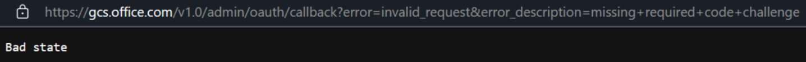
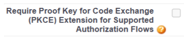
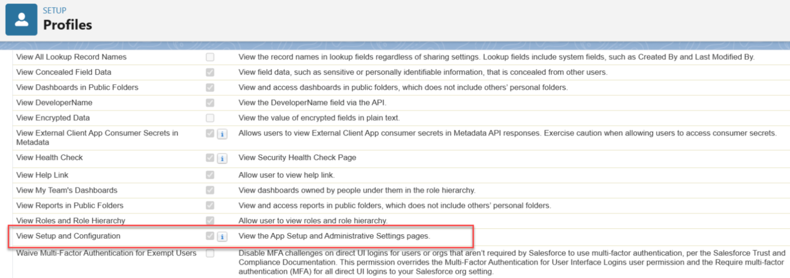

# Troubleshoot issues with the Salesforce CRM connector

The Salesforce CRM Microsoft 365 Copilot connector enables your organization to index accounts, contacts, leads, opportunities, and cases from Salesforce so users can find that data in Microsoft 365 Copilot and Microsoft Search.

This article provides troubleshooting information for common errors that you might encounter when you deploy the Salesforce CRM connector.

To verify Salesforce configuration information to help troubleshoot errors, see [Set up the Salesforce service for connector ingestion](salesforce-crm-admin-setup.md).

## Bad state error while signing in to create a connection

The PKCE option is checked in the External Client App, causing the issue. To fix it:

1. In Salesforce, go to **Setup** > **Apps** > **External Client Apps** > **External Client App Manager**.
1. Select the app used for the connector.
1. On the **Settings** tab, select **Edit**.
1. In the **OAuth Settings** section, clear **Require Proof Key for Code Exchange (PKCE)**.
1. Select **Save**.

## OAuth app scope names changed

The names of the selected OAuth scopes changed to the following names: 

- **Access and manage your data (API)** is now **Manage user data via APIs (api)**
- **Perform requests on your behalf at any time (refresh_token, offline_access)** is now **Perform requests at any time (refresh_token, offline_access)**

If you configured the app before the scope rename, verify that the correct scopes are still selected in the External Client App's OAuth Settings.

## Insufficient permissions

Review the setup of the configured user profile. The `View Setup and Configuration` permission must be checked and the API must be enabled for `Org` and `Profile`.

 

Under **Administrative Permissions**, ensure `View Roles and Role Hierarchy`, `View All Profiles`, and `View All Users` permissions are in place. Under **Standard Object Permissions**, ensure `Read` and `View All` permissions to the following objects: Accounts, Cases, Contacts, Leads, and Opportunities.

## Can't search for items from a field

If you don't see any results from a particular field in Salesforce, make sure the connector indexes the field and that Field-Level Security isn't enabled for it.

- Check if the connector indexes the field in the **Manage Properties** section of the **Content** tab in your connector setup. Make sure the connector supports the field you're searching for.
- Check if the field is indexed for the specific item you're searching from the [Index browser](./indexed-content.md). Make sure the field you're searching for on the item is in an **Indexed** state.
- Check the Field-Level Security settings in **Salesforce** from **Setup** > **Object Manager** > **Select Object** > **Fields & Relationships** > **Select Field name** > **View Field Accessibility**. Make sure the field you're searching for doesn't have Field-Level Security enabled.

For more information about the types of errors, go to the **error details** page after selecting the connection. Select the **error code** to see more detailed errors. Also refer to [Monitor your connections](./manage-connector.md) to learn more.

## Connection goes stale after 24 hours

If the connection shows an authorization error after approximately 24 hours, the refresh token policy is set to expire. To fix it:

1. In Salesforce, go to **Setup** > **Apps** > **External Client Apps** > **External Client App Manager**.
1. Select the app used for the connector.
1. Select the **Policies** tab.
1. In **OAuth Policies**, set **Refresh Token Policy** to **Refresh token is valid until revoked**.
1. Select **Save**.

After updating the policy, re-authorize the connection in the Microsoft 365 admin center.

## Custom fields not appearing in search results

If custom fields you selected in the **Add Properties** panel aren't appearing in Copilot or Search results:

- Verify that the custom field still exists in the Salesforce org. Deleted or renamed fields are auto-deselected on the next crawl.
- Check that the connection completed at least one full crawl after you added the custom fields.
- If you promoted the field to a schema property, verify that the property or queryable limit wasn't exceeded. Open the **Add Properties** panel and check the budget counters.

If your scenario needs objects or fields not covered by the connector's default behavior, see [Build a custom Salesforce CRM connector](salesforce-custom-connector-sample.md) for a reference implementation built with the [Copilot connectors API](/graph/connecting-external-content-connectors-api-overview) (source code: [microsoft/Salesforce-Custom-Copilot-Connector](https://github.com/microsoft/Salesforce-Custom-Copilot-Connector)).

## Related content

- [Salesforce CRM connector overview](salesforce-crm-overview.md)
- [Deploy the Salesforce CRM connector](salesforce-crm-deployment.md)
