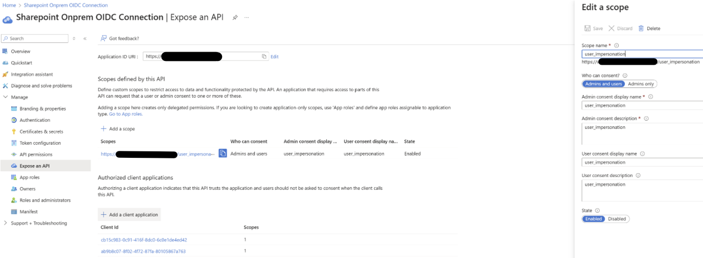
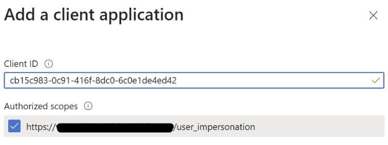

# Set up the SharePoint Server service for connector ingestion

The SharePoint Server connector enables Microsoft 365 Copilot to index content from your on-premises SharePoint Server farm, making it discoverable through Copilot experiences while respecting your existing SharePoint permissions.

This article provides information about the configuration steps that SharePoint Server admins need to complete in order for your organization to deploy the [SharePoint Server connector](sharepoint-server-overview.md).

For information about how to deploy the connector, see [Deploy the SharePoint Server connector](sharepoint-server-deployment.md).

## Setup checklist

The following checklists list the steps involved in configuring the environment and setting up the connector prerequisites.

### Configure the environment

| Task | Role |
| ---- | ---- |
| [Identify the SharePoint Server instance URL](#identify-the-sharepoint-server-instance-url) | SharePoint Server farm administrator |
| [Install & Configure the Microsoft Graph connector agent](#install-and-configure-the-microsoft-graph-connector-agent) | AI administrator (agent installation), Azure App admin (app registration in Entra ID) |
| [Sync Active Directory to Microsoft Entra ID](#sync-active-directory-to-microsoft-entra-id) (required for **Only people with access** permission option) | Entra ID admin |

### Set up prerequisites

| Task | Role |
| ---- | ---- |
| [Configure authentication](#configure-authentication) | Basic / Windows (NTLM), SharePoint trust configuration: SharePoint Server farm administrator.<br />Microsoft Entra ID OpenID Connect (OIDC): Entra ID admin |

## Configure the SharePoint Server environment

The following sections describe the admin tasks to configure the SharePoint Server environment to enable and optimize the connection.

### Identify the SharePoint Server instance URL

The SharePoint Server instance URL is the root URL of the web application you want to crawl (for example, `https://sharepoint.contoso.com`). You need this URL when you register the Microsoft Graph connector agent and when configuring the connector.

To identify the URL:

1. Open SharePoint Central Administration as a SharePoint Server farm administrator.
1. Go to **Application Management** > **Manage web applications**.
1. Select the web application that hosts the content you want to index, and note the URL listed in the **URL** column.

If you plan to crawl multiple site collections under different host headers, record each URL. You'll reference all of them during connector setup and OIDC configuration.

### Install and configure the Microsoft Graph connector agent

The Microsoft Graph connector agent is a Windows service that crawls your SharePoint Server content locally and securely sends it to Microsoft 365 for indexing - without exposing your internal farm directly to the internet. You must install and register the Microsoft Graph connector agent to use the SharePoint Server connector.  You can install the agent on the SharePoint server itself or on any computer with network access to the farm.

For more information, see [Install and configure the Microsoft Graph connector agent](connector-agent.md).

### Sync Active Directory to Microsoft Entra ID

The connector defaults to **Only people with access** permission mode, which respects your SharePoint Server permissions and ensures users see only content they're authorized to access.

> [!IMPORTANT]
> Active Directory sync is a critical prerequisite for this permission mode. Without it, the connector can't map SharePoint Server permissions to Microsoft 365 user identities, and the **Only people with access** mode doesn't function correctly.

For more information, see [What is Microsoft Entra Connect Sync](/entra/identity/hybrid/connect/how-to-connect-sync-whatis).

## Set up connector prerequisites

The following sections describe the prerequisite steps to complete before deploying the SharePoint Server connector.

### Configure authentication

The SharePoint Server connector supports the following authentication types:

- **Basic** - Not recommended. Included for compatibility with legacy systems, but will be removed in the future.
- **Windows (NTLM)** - Use the Domain\username format in the **Username** field. Only NTLM is currently supported; Kerberos isn't supported.
- **Microsoft Entra ID OIDC** - Requires additional configuration described in the following sections.

> [!NOTE]
> - At a minimum, the account used for authentication during connection setup must have **Full Read** permission at the Web Application level in SharePoint Server, regardless of the authentication type selected. For indexing, grant this account full control at the Web Application level or make it a SharePoint Server farm administrator. Set Web Application-level permissions in SharePoint Central Administration and require SharePoint Server farm administrator access.
> - The indexing process skips items that this account doesn't have access to.
> - Active Directory Federation Services (ADFS) authentication isn't supported. If your SharePoint farm uses ADFS as its identity provider, use Basic, Windows (NTLM), or Microsoft Entra ID OIDC authentication instead.

> [!TIP]
> If you're using Basic or Windows (NTLM) authentication, proceed to [Deploy the SharePoint Server connector](sharepoint-server-deployment.md). If you're using Microsoft Entra ID OIDC, complete the steps in the following section.

#### Set up Microsoft Entra ID OIDC authentication

OIDC (OpenID Connect) is a modern authentication protocol that lets SharePoint Server verify identities through Microsoft Entra ID. By using OIDC, you can enable token-based access and single sign-on without passing credentials directly. It's the most secure option, but it requires the additional setup steps in this section.

Before using Microsoft Entra ID-based authentication, ensure the following prerequisites are met:

- Microsoft Graph connector agent (GCA) version 3.1.2.0 and later supports Microsoft Entra ID-based authentication. Upgrade your agent before proceeding. To learn more, see [Install and configure the Microsoft Graph connector agent](connector-agent.md).
- Microsoft Entra ID-based authentication supports only SharePoint Server Subscription Edition. Make sure the farm is patched to the November 2024 build (16.0.17928.20238) or later. For more information, see [SharePoint Updates](/officeupdates/sharepoint-updates).
- Set up OIDC with Microsoft Entra ID. Because OIDC requires HTTPS, make sure your SharePoint web applications are configured to use HTTPS.

##### Install Microsoft Entra ID Connect

1. [Download](https://www.microsoft.com/download/details.aspx?id=47594) Microsoft Entra ID Connect.
1. Follow the [steps](/entra/identity/hybrid/connect/how-to-connect-install-roadmap) to install Microsoft Entra ID Connect.

##### Set up OIDC with Microsoft Entra ID

Set up and enable OIDC with Microsoft Entra ID by using the steps described in [Set up OIDC authentication in SharePoint Server with Microsoft Entra ID](/sharepoint/security-for-sharepoint-server/set-up-oidc-auth-in-sharepoint-server-with-msaad). This step requires you to set up a third-party application in the Microsoft Entra admin center. Make sure that you have admin rights to perform this step.

##### Configure Expose an API

1. Browse to the Microsoft Entra admin center and sign in as a Microsoft Entra ID admin.
1. Select **App registrations**, and choose the application that you created to enable OIDC authentication for your SharePoint Server web app.
1. Go to **Expose an API**.
1. Select **Add** next to Application ID URI. Make sure the application ID URI matches your SharePoint Server web application URL.

   

1. Select **Add a scope**, enter **user_impersonation** for the scope name, admin consent display name, and admin consent description. Make sure the **State** is set to **Enabled** and choose **Add scope**.

   > [!NOTE]
   > This scope grants the connector permission to act on behalf of authenticated users when accessing SharePoint content, ensuring it retrieves only what each user is authorized to see.
1. Select **Add a client application**. Enter the connector agent client ID: **cb15c983-0c91-416f-8dc0-6c0e1de4ed42**.
1. Under **Authorized Scopes**, select the user_impersonation scope for your web app and select **Add application**.

   

##### Configure the scoped client identifier

When using OIDC authentication with SharePoint Server, you must set the `ScopedClientIdentifier` property on the `SPTrustedIdentityTokenIssuer` for the SharePoint Server connector to authenticate and crawl your content. This property maps each SharePoint site URL to an Entra ID application registration (the app identity configured during your OIDC setup), so SharePoint knows which app is permitted to access each site.

> [!IMPORTANT]
> Setting the `ScopedClientIdentifier` property isn't required for OIDC to function in SharePoint Server itself, but it's mandatory for the connector. Without this mapping, SharePoint Server can't verify the connector's identity for the site, resulting in a 401 Unauthorized error.

Before you begin, have the following ready:

- **Application ID URI**: Set in the [Configure Expose an API](#configure-expose-an-api) section above (for example, `api://xxxxxxxx-xxxx-xxxx-xxxx-xxxxxxxxxxxx`).
- **Token issuer name**: The name of the `SPTrustedIdentityTokenIssuer` - the SharePoint object that trusts your Entra ID identity provider, created in the [Set up OIDC with Microsoft Entra ID](#set-up-oidc-with-microsoft-entra-id) section. If you don't remember the name, run `Get-SPTrustedIdentityTokenIssuer` without parameters to list all configured issuers.

Run the following PowerShell commands in the SharePoint Management Shell as a SharePoint Server farm administrator:

```powershell
# Get the existing trusted identity token issuer
$t = Get-SPTrustedIdentityTokenIssuer -Identity "<TrustedIdentityTokenIssuerName>"

# (Optional) Verify the current ScopedClientIdentifier value
$t.ScopedClientIdentifier

# Add the scoped client identifier for the SharePoint site
# The .Add() method requires a Uri object (not a plain string) and the Application ID URI
$uri = New-Object System.Uri("<SharePointSiteUrl>")
$t.ScopedClientIdentifier.Add($uri, "<EntraIdAppIdentifierUri>")
$t.Update()
```

| Placeholder | Description | Example |
|---|---|---|
| `<TrustedIdentityTokenIssuerName>` | Name of the SPTrustedIdentityTokenIssuer created during OIDC setup | `OIDC Entra ID` |
| `<SharePointSiteUrl>` | URL of the SharePoint site collection | `https://sharepoint.contoso.com/` |
| `<EntraIdAppIdentifierUri>` | Application ID URI of the Entra ID app registration | `api://xxxxxxxx-xxxx-xxxx-xxxx-xxxxxxxxxxxx` |

> [!TIP]
> If you're crawling multiple site collections (for example, `https://portal.contoso.com` and `https://hr.contoso.com`), you must run `$t.ScopedClientIdentifier.Add()` for each unique URL. You can either batch multiple `.Add()` calls and then run `$t.Update()` once, or call `$t.Update()` after each individual `.Add()`.

## Next step

> [!div class="nextstepaction"]
> [Deploy the SharePoint Server connector](sharepoint-server-deployment.md)
