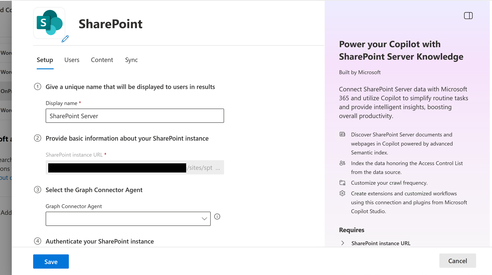

# Deploy the SharePoint Server connector in the Microsoft 365 admin center

This page describes how to deploy and customize the SharePoint Server Copilot connector in the Microsoft 365 admin center. For general deployment information, see [Set up Copilot connectors in the Microsoft 365 admin center](deployment-overview.md).

If you haven't completed SharePoint Server environment setup yet, start with [Configure SharePoint Server](sharepoint-server-configuration.md) before proceeding.

[!INCLUDE [connector-preview-access](includes/connector-preview-access.md)]

> [!NOTE]
> To deploy connectors in the Microsoft 365 admin center, you must be an **AI administrator**.

To add the SharePoint Server Copilot connector for your organization, go to the [connector gallery](https://admin.cloud.microsoft/#/copilot/connectors/add) in the Microsoft 365 admin center, search for **SharePoint Server** in the search bar, and select **Add**.

Alternatively, if you're starting from the main [Microsoft 365 admin center](https://admin.cloud.microsoft):

1. In the left pane, choose **Copilot** > **Connectors**.
1. Choose the **Connectors** tab, then select **Gallery**.
1. Search for **SharePoint Server**, and select **Add**.

The connector has two setup modes:

- [**Default setup**](#default-setup) (required) — Gets you up and running immediately. Provide a display name, SharePoint instance URL, connector agent, authentication credentials, and site collections to create the connection. Everything else is pre-configured with sensible defaults.
- [**Custom setup**](#custom-setup) (optional) — Fine-tune the connection at creation time or later. Configure access permissions, content exclusions, properties, and sync schedules to meet your organization's specific needs.

## Default setup

### Set display name

The display name is the user-facing name for this connector in Copilot. It identifies references in Copilot responses, signifies trusted content, and is used as a [content source filter](/microsoftsearch/custom-filters#content-source-filters). It also helps users select the right connector when adding knowledge sources to their agents.

You can accept the default SharePoint Server display name, or customize it to reflect your organization's terminology.

For more information about connector display names and descriptions, see [Enhance Copilot discovery with Microsoft 365 Copilot connectors content](enhance-copilot-discovery.md).

### Set SharePoint instance URL

Enter the URL for the SharePoint site or site collection in the format `https://{domain}/sites/{site-name}`. The connector uses this URL to identify the web application. After you authenticate, it lists all available site collections for you to choose from.

### Select Graph Connector Agent

Select from the list of available Microsoft Graph connector agents registered to your tenant.

> [!NOTE]
> Each SharePoint web application requires its own connection. The same agent can be selected for multiple connections, but we recommend no more than three connections per agent to maintain optimal indexing performance. If you need to index more than three web applications, install additional agents and distribute the connections across them.

### Choose authentication type

Choose the authentication type from the drop-down menu, then enter the required credentials for your chosen method:

- **Basic (Deprecating Soon)** — Enter a username and password. Not recommended; this option will be removed in a future release.
- **Windows (NTLM)** — Enter credentials in **domain\alias** format and a password. Only NTLM is supported; Kerberos is not supported.
- **Microsoft Entra ID OIDC** — Enter the **Client ID** of the Entra ID app registration created during OIDC setup. Complete all steps in [Configure SharePoint Server](sharepoint-server-configuration.md) before selecting this option.

> [!NOTE]
> The account used for authentication must have at least **Full Read** permission at the Web Application level in SharePoint Server, regardless of the authentication type selected.

> [!NOTE]
> Active Directory Federation Services (ADFS) authentication is not supported.

After entering credentials, select **Authorize** to verify access and load the list of available site collections.

### Select site collections

Select which site collections you want to index. The site collections belong to the web application within the SharePoint URL provided. This list can be long based on the number of site collections available in the data source.

### Roll out

Before you can create the connection, make sure:

- **Authentication is successful** — After selecting **Authorize**, a green check mark appears next to the button confirming your credentials are valid and the site collections have loaded.
- **Notice is accepted** — Read and accept the data indexing notice. The **Create** button remains disabled until this checkbox is selected.

Once both conditions are met, select **Create** to publish your connection and begin indexing the selected content.

In this mode, the following values are used:

| Category | Setting | Default value |
|----------|---------|---------------|
| Users | Access permissions | Only people with access to the content in the data source. |
| Sync | Incremental crawl | Frequency: Every 15 minutes |
| Sync | Full crawl | Frequency: Every day |

To customize these values, see [Custom setup](#custom-setup).

### Review connection status

Once the connection creation is successful, it starts indexing (syncing) the content. At this time, admins are asked to provide a description for the connection. The description helps Copilot discover the connection content better. The better the connection description for the intended content usage, the better Copilot's responses. The description is also useful for users to select the right connection for their Declarative Agents.

For more information about writing effective connection descriptions, see [Enhance Copilot discovery with Microsoft 365 Copilot connectors content](enhance-copilot-discovery.md).

### Monitor and validate the connection

After the connection is created, return to **Copilot** > **Connectors** in the Microsoft 365 admin center and select the **Your Connections** tab to track its progress. The connection first shows a **Syncing** status while the initial full crawl runs.

> [!NOTE]
> The time to reach **Ready** status depends on the volume of content in the selected site collections. Check back periodically — do not proceed with validation until the connection shows **Ready**.

If the connection shows a **Failed** status, select the connection name and go to the **Error** tab in the details panel to review the details.

Once the connection shows a **Ready** status, select the connection name to open the details panel. The panel has the following tabs:

- **Detail** — Shows the number of items indexed, item errors, user and group errors, and the connection description.
- **Statistics** — Shows indexing activity and crawl statistics.
- **Error** — Lists any errors encountered during indexing.
- **Index browser** — Lets you verify whether a specific item was indexed by entering its SharePoint URL.

To validate that a document or site page was indexed, go to the **Index browser** tab and enter the URL of the SharePoint item. If the item is indexed, it shows an **Indexed** badge along with three sub-tabs for deeper inspection:

- **Content** — Shows the indexed properties and their status.
- **Permissions** — Shows the item's visibility (for example, "visible to all users").
- **Check user access** — Search by user name or email to confirm whether a specific user has access to the item.

If items are missing or permissions look incorrect, refer to [Troubleshoot issues with the SharePoint Server connector](sharepoint-server-connector-troubleshooting.md).

## Custom setup

Custom setup is the other mode, for admins who want more control over the connection settings. You can get into this mode in two ways.

- **Creating a new connection** — Select **Custom setup** at the top right of the setup screen to get three additional tabs alongside the standard setup fields: **Users**, **Content**, and **Sync**.
- **Editing an existing connection** — The connection always opens in Custom setup. Some fields on the **Setup** tab cannot be changed after the connection is created.

### Setup tab

For the **Setup** tab, follow the same instructions in [Set display name](#set-display-name) through [Select site collections](#select-site-collections) under Default setup.

### Users

The SharePoint Server connector supports the following user search permissions:

- **Only people with access to the content in the data source (default)** – Indexed data appears in the search results or in Copilot responses to users who have permission to view it in SharePoint.
- **Everyone** – The connection is open to everyone, and any user in your organization can see the content irrespective of the permissions in SharePoint Server.

For the **Only people with access to the content in the data source** option to work correctly, Active Directory identities must be synced with Microsoft Entra ID. See [Sync Active Directory to Microsoft Entra ID](sharepoint-server-configuration.md#sync-active-directory-to-microsoft-entra-id).

> [!NOTE]
> Copilot connectors support Users, Security Groups, and Distribution Lists. However, SharePoint Server does not support Distribution Lists as Access Control Lists. If there are nested distribution lists, members of those distribution lists may also get access to content through Graph connectors.

### Content

#### Exclude sites from indexing

Add the URLs of the sites you want to exclude from indexing. Exclusion rules work at the site or subsite level only. Don't add URLs to site contents like libraries or documents, as those exclusions are not honored. You can use the wildcard `*` at the end of a URL to exclude all contents of sites and subsites that begin with that URL.

If the URL ends with `/*`, then all URLs prefixed with the entered URL are excluded from indexing. For example, `abc.com/private/*` excludes `abc.com/private/terms.html` and all content inside `/private`. However, if you provide `abc.com/private/terms.html` as the URL to exclude, it is not honored because exclusion rules work only at the site or subsite level.

#### Manage properties

Properties define what data is available for searching, querying, retrieving, and refining. From this setting, you can add or remove data source properties, assign a schema annotation to a property (searchable, queryable, retrievable, or refinable), change the semantic label, and add an alias. The following properties are indexed by default.

> [!TIP]
> For most deployments, the default properties are sufficient. Add custom properties only if your organization needs to search or filter on specific SharePoint columns.

| Source property | Label | Description | Schema |
|---|---|---|---|
| Content | | Content of the item | Search |
| CreatedBy | Created by | The owner who created the item | Query, Retrieve, Search |
| CreatedByUpn | | The User Principal Name (UPN) of the owner who created the item | Query, Retrieve, Search |
| CreatedTime | Created date time | Date and time that the item was created in the data source | Query, Retrieve |
| DocumentType | | The type of document | Retrieve |
| IcnUrl | IconUrl | Icon URL for the item type | Retrieve |
| LastAccessed | | Date and time that the item was last accessed | Query, Retrieve |
| LastModified | Last modified date time | Date and time that the item was last modified | Query, Retrieve |
| LastModifiedBy | Last modified by | The user who modified the item | Query, Retrieve |
| LastModifiedByUpn | | The User Principal Name (UPN) of the user who modified the item | Retrieve, Search |
| Name | Title | The title of the item that you want to show in Copilot and other search experiences | Query, Retrieve, Search |
| ObjectType | | The type of object as returned from the data source | Query, Retrieve, Search |
| Url | | Item URL | Retrieve |

You can add custom properties defined in your sites to better manage the search or Copilot outcomes for your users. To add a custom property, select **Add property** and specify the exact string from the data source. Define a property name and data type (String, StringCollection, DateTime, Boolean, Int64, or Double). Custom properties match the custom columns in SharePoint.

> [!IMPORTANT]
> Property names must match the column names in SharePoint exactly. The connector silently ignores any property name that doesn't match an existing column during crawling. Double-check spelling before saving.

> [!NOTE]
> A total of 128 properties are supported. If you are selecting multiple site collections in a single connection, only default properties are supported. If you want to support custom properties defined in a site, create a different connection and add custom properties for that site.

### Sync

The Sync tab controls how often your content is refreshed between SharePoint Server and the connector index. You can also set the **Time zone** used to schedule crawls.

Copilot connectors use two types of refresh intervals:

- **Full crawl** — Runs on a recurrence you set (default: every day). You can optionally specify a starting time.
- **Incremental crawl** — Runs on a recurrence and frequency you set (default: every day, every 15 minutes). Can be toggled on or off independently of the full crawl.

For more information, see [Guidelines for crawl settings](deployment-overview.md#guidelines-for-crawl-settings).

Once you've configured these settings, follow the steps in [Roll out](#roll-out), [Review connection status](#review-connection-status), and [Monitor and validate the connection](#monitor-and-validate-the-connection).

## Set up Microsoft Search result page

This section applies to Microsoft Search only. After creating the connection, customize the search results page with verticals and result types to surface SharePoint Server content in Microsoft Search. To learn more, review how to [manage verticals](/microsoftsearch/manage-verticals) and [result types](/microsoftsearch/manage-result-types).

## Next step

> [!div class="nextstepaction"]
> [Troubleshoot issues with the SharePoint Server connector](sharepoint-server-connector-troubleshooting.md)

## Related content

- [SharePoint Server connector overview](sharepoint-server-connector-overview.md)
- [Configure SharePoint Server](sharepoint-server-configuration.md)
- [Troubleshoot issues with the SharePoint Server connector](sharepoint-server-connector-troubleshooting.md)
