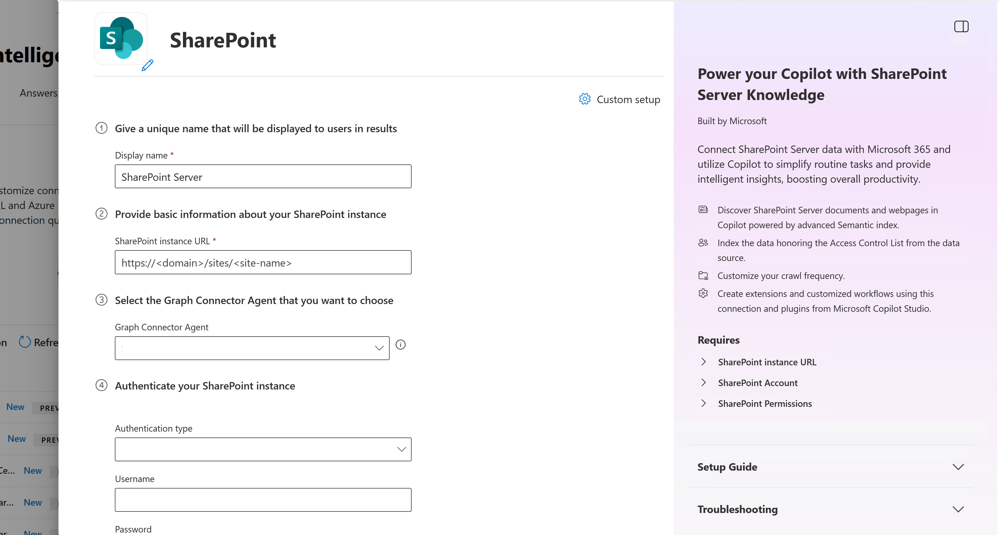
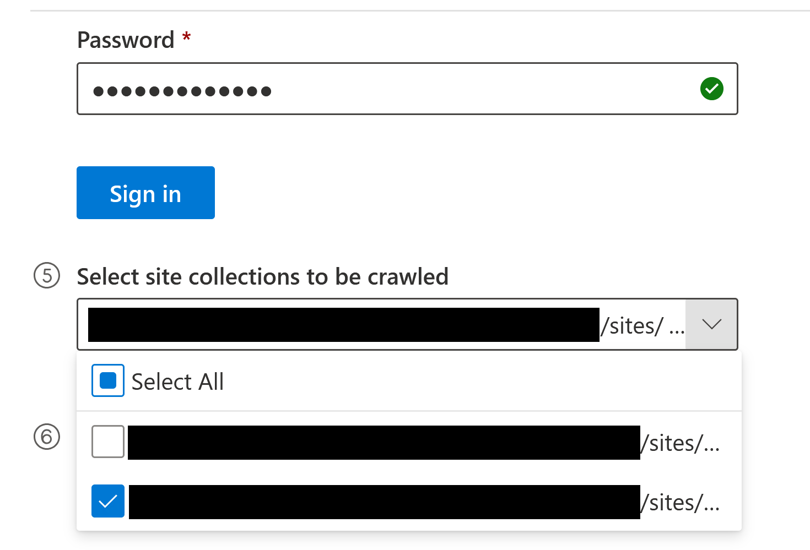
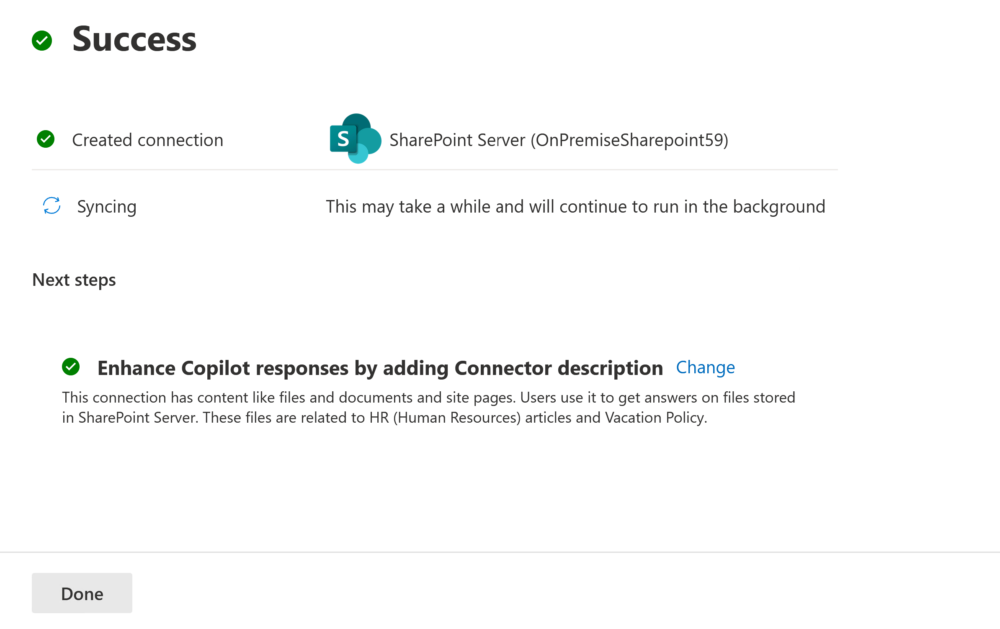
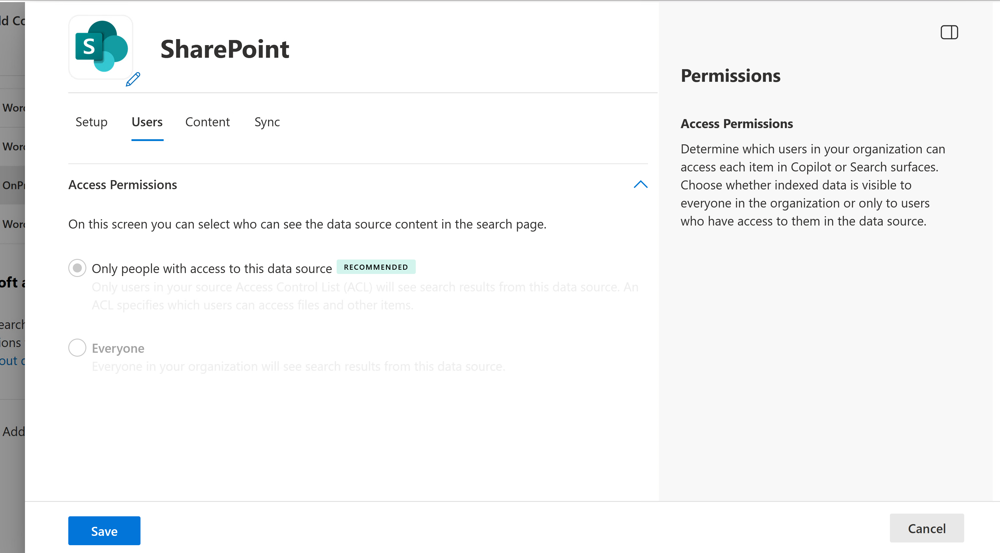
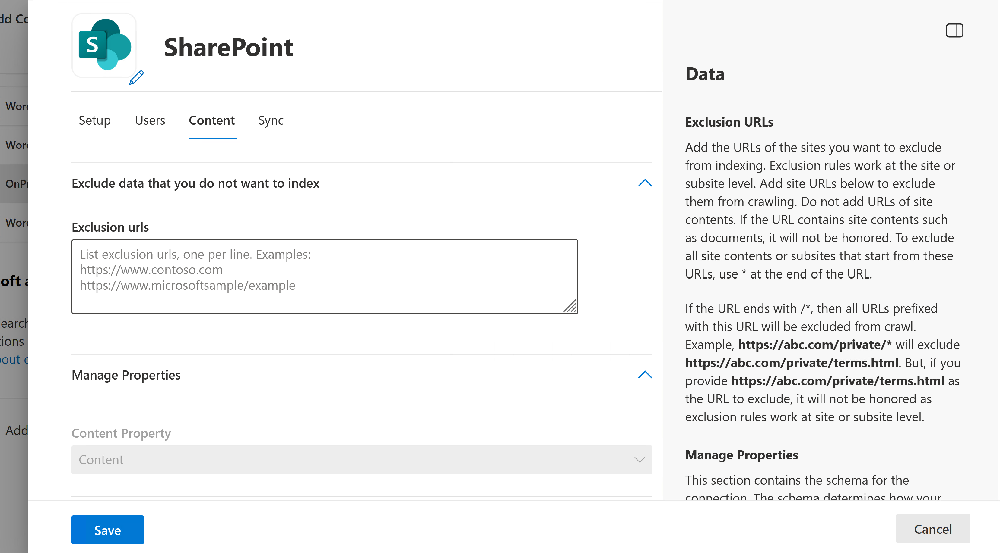
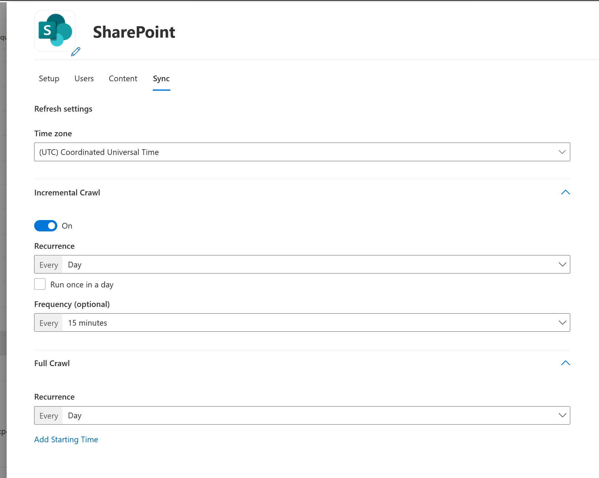

# Deploy the SharePoint Server connector

The SharePoint Server connector enables Microsoft 365 Copilot to index content from your on-premises SharePoint Server farm. By using this connector, you can make documents, pages, and lists discoverable through Copilot experiences while respecting your existing SharePoint permissions.

This article describes the steps to deploy and customize the SharePoint Server connector. For advanced SharePoint Server configuration information, see [Set up the SharePoint Server service](sharepoint-server-admin-setup.md).

## Prerequisites

Before you deploy the SharePoint Server connector, make sure that your organization has a configured SharePoint Server environment. The following table summarizes the steps to configure the SharePoint Server environment and deploy the connector.

| Task | Role |
| ---- | ---- |
| [Configure the environment](sharepoint-server-admin-setup.md#configure-the-sharepoint-server-environment) | SharePoint Server admin |
| [Set up prerequisites](sharepoint-server-admin-setup.md#set-up-connector-prerequisites) | SharePoint Server admin/Network admin |
| [Deploy the connector in the Microsoft 365 admin center](#deploy-the-connector) | Microsoft 365 admin |
| [Customize connector settings](#customize-settings-optional) (optional) | Microsoft 365 admin |

Before you deploy the connector, make sure that you meet the following prerequisites:

- You're an **AI administrator** in Microsoft 365 to deploy connectors in the Microsoft 365 admin center.
- The SharePoint Server environment is configured. For details, see [Set up SharePoint Server](sharepoint-server-admin-setup.md).
- The Microsoft Graph connector agent is installed and registered to your tenant.
- If you plan to use Microsoft Entra ID OpenID Connect (OIDC) authentication, OIDC and the scoped client identifier are configured. For details, see [Set up Microsoft Entra ID OIDC authentication](sharepoint-server-admin-setup.md#set-up-microsoft-entra-id-oidc-authentication).

## Deploy the connector

To add the SharePoint Server connector for your organization:

1. In the Microsoft 365 admin center, in the left pane, select **Copilot** > **Connectors**.
1. Choose the **Gallery** tab.
1. From the list of available connectors, select **SharePoint Server**.

Alternatively, go directly to the [connector gallery](https://admin.cloud.microsoft/#/copilot/connectors/add), search for **SharePoint Server**, and select **Add**.

### Set display name

The display name identifies references in Copilot responses to help users recognize the associated file or item. The display name also signifies trusted content and is used as a [content source filter](/microsoftsearch/custom-filters#content-source-filters). It also helps users select the right connector when adding knowledge sources to their agents.

You can accept the default **SharePoint Server** display name, or customize the value to use a display name that users in your organization recognize.

For more information about connector display names and descriptions, see [Enhance Copilot discovery of connector content](enhance-copilot-discovery.md).

### Set instance URL

Enter the URL for the SharePoint site or site collection in the format `https://{domain}/sites/{site-name}`. The connector uses this URL to identify the web application. After you authenticate, it lists all available site collections for you to choose from.

### Select Microsoft Graph connector agent

Select from the list of available Graph Connector Agents registered to your tenant.

> [!NOTE]
> Each SharePoint web application requires its own connection. You can select the same agent for multiple connections, but don't use more than three connections per agent to maintain optimal indexing performance. If you need to index more than three web applications, install extra agents and distribute the connections across them.

### Choose authentication type

Choose the authentication type from the drop-down menu, and then enter the required credentials for your chosen method:

- **Basic (deprecated)** — Enter a username and password. This option is deprecated and will be removed.
- **Windows (NTLM)** — Enter credentials in **domain\alias** format and a password. Only NTLM is supported; Kerberos isn't supported. Recommended for farms that don't use Microsoft Entra ID OIDC.
- **Entra ID OIDC** — Enter the **Client ID** of the Entra ID app registration created during OIDC setup. Complete all steps in [Set up the SharePoint Server service for SharePoint Server connector ingestion](sharepoint-server-admin-setup.md) before selecting this option. Recommended for the most secure, token-based authentication.

> [!NOTE]
> The account used for authentication must have at least **Full Read** permission at the Web Application level in SharePoint Server, regardless of the authentication type selected.

> [!NOTE]
> Active Directory Federation Services (ADFS) authentication isn't supported.

After you enter credentials, select **Authorize** to verify access and load the list of available site collections.

### Select site collections

Select which site collections you want to index. The site collections belong to the web application within the SharePoint URL you provide. This list can be long based on the number of site collections available in the data source.

### Roll out

Before you create the connection, make sure that:

- **Authentication is successful** — After selecting **Authorize**, a green check mark appears next to the button confirming your credentials are valid and the site collections are loaded.
- **Notice is accepted** — Read and accept the data indexing notice. The **Create** button remains disabled until you select this checkbox.

To roll out to a limited audience, choose the toggle next to **Rollout to limited audience** and specify the users and groups to roll the connector out to. For more information, see [Staged rollout for Copilot connectors](staged-rollout.md).

Choose **Create** to deploy the connection. The SharePoint Server Copilot connector starts indexing content right away.

The following table lists the default values that are set.

| Category | Default value |
|----------|---------------|
| Users    | Only people with access to the content in the data source |
| Content  | All selected site collections under the specified web application; no exclusion rules |
| Sync     | Full crawl: every day; Incremental crawl: every 15 minutes |

To customize these values, choose **Custom setup**. For more information, see [Customize settings](#customize-settings-optional).

After you create your connection, you can review the status in the **Connectors** section of the [Microsoft 365 admin center](https://admin.microsoft.com/).

### Review connection status

When you create the connection, it starts indexing (syncing) the content. At this time, admins are asked to provide a description for the connection. The description helps Copilot discover the connection content better. The better the connection description for the intended content usage, the better Copilot's responses. The description is also useful for users to select the right connection for their declarative agents.

For more information about writing effective connection descriptions, see [Enhance Copilot discovery with Microsoft 365 Copilot connectors content](enhance-copilot-discovery.md).

### Monitor and validate the connection

After you create the connection, return to **Copilot** > **Connectors** in the Microsoft 365 admin center and select the **Your Connections** tab to track its progress. The connection first shows a **Syncing** status while the initial full crawl runs.

> [!NOTE]
> The time to reach **Ready** status depends on the volume of content in the selected site collections. Check back periodically - don't proceed with validation until the connection shows **Ready**.

If the connection shows a **Failed** status, select the connection name and go to the **Error** tab in the details panel to review the details.

When the connection shows a **Ready** status, select the connection name to open the details panel. The panel has the following tabs:

- **Detail** — Shows the number of items indexed, item errors, user and group errors, and the connection description.
- **Statistics** — Shows indexing activity and crawl statistics.
- **Error** — Lists any errors encountered during indexing.
- **Index browser** — Lets you verify whether a specific item was indexed by entering its SharePoint URL.

To validate that a document or site page was indexed, go to the **Index browser** tab and enter the URL of the SharePoint item. If the item is indexed, it shows an **Indexed** badge along with three sub-tabs for deeper inspection:

- **Content** — Shows the indexed properties and their status.
- **Permissions** — Shows the item's visibility (for example, "visible to all users").
- **Check user access** — Search by user name or email to confirm whether a specific user has access to the item.

If items are missing or permissions look incorrect, refer to [Troubleshoot issues with the SharePoint Server connector](sharepoint-server-troubleshooting.md).

## Customize settings (optional)

You can customize the default values for the SharePoint Server connector settings. To customize settings, on the connector page in the admin center, choose **Custom setup**.

You can enter Custom setup in two ways:

- **Create a new connection** — Select **Custom setup** at the top right of the setup screen to get three additional tabs alongside the standard setup fields: **Users**, **Content**, and **Sync**.
- **Edit an existing connection** — The connection always opens in Custom setup. Some fields on the **Setup** tab can't be changed after the connection is created.

### Customize user settings

#### Access permissions

The SharePoint Server connector supports the following user search permissions:

- **Only people with access to the content in the data source (default)** – Indexed data appears in the search results or in Copilot responses to users who have permission to view it in SharePoint Server.
- **Everyone** – The connection is open to everyone, and any user in your organization can see the content irrespective of the permissions in SharePoint Server.

For the **Only people with access to the content in the data source** option to work correctly, Active Directory identities must be synced with Entra ID. See [Sync Active Directory to Microsoft Entra ID](sharepoint-server-admin-setup.md#sync-active-directory-to-microsoft-entra-id).

> [!NOTE]
> Copilot connectors support Users, Security Groups, and Distribution Lists. However, SharePoint Server doesn't support Distribution Lists as Access Control Lists. If there are nested distribution lists, members of those distribution lists might also get access to content through Graph connectors.

#### Map identities

Active Directory synchronization with Entra ID handles identity mapping for the SharePoint Server connector. The connector uses the synced identities to evaluate **Only people with access** permissions against Microsoft 365 user accounts.

If you have non-standard identity mappings (for example, different UPN suffixes between Active Directory and Entra ID), confirm that Microsoft Entra Connect Sync is configured correctly. See [Sync Active Directory to Microsoft Entra ID](sharepoint-server-admin-setup.md#sync-active-directory-to-microsoft-entra-id).

### Customize content settings

#### Query string

The SharePoint Server connector doesn't use a query string filter. Instead, you control which content is indexed by choosing site collections during setup and by adding exclusion rules, as described in the following section.

#### Exclude sites from indexing

Add the URLs of the sites you want to exclude from indexing. Exclusion rules work at the site or subsite level only. Don't add URLs to site contents like libraries or documents, as those exclusions aren't honored. You can use the wildcard `*` at the end of a URL to exclude all contents of sites and subsites that begin with that URL.

If the URL ends with `/*`, then all URLs prefixed with the entered URL are excluded from indexing. For example, `abc.com/private/*` excludes `abc.com/private/terms.html` and all content inside `/private`. However, if you provide `abc.com/private/terms.html` as the URL to exclude, it's not honored because exclusion rules work only at the site or subsite level.

#### Manage properties

Properties define what data is available for searching, querying, retrieving, and refining. From this setting, you can add or remove data source properties, assign a schema annotation to a property (searchable, queryable, retrievable, or refinable), change the semantic label, and add an alias. The following properties are indexed by default.

> [!TIP]
> For most deployments, the default properties are sufficient. Add custom properties only if your organization needs to search or filter on specific SharePoint columns.

| Property | Semantic Label | Description | Schema Attributes |
|----------|----------------|-------------|-------------------|
| Content | | Content of the item | Search |
| CreatedBy | Created by | The owner who created the item | Query, Retrieve, Search |
| CreatedByUpn | | The User Principal Name (UPN) of the owner who created the item | Query, Retrieve, Search |
| CreatedTime | Created date time | Date and time that the item was created in the data source | Query, Retrieve |
| DocumentType | | The type of document | Retrieve |
| IcnUrl | IconUrl | Icon URL for the item type | Retrieve |
| LastAccessed | | Date and time that the item was last accessed | Query, Retrieve |
| LastModified | Last modified date time | Date and time that the item was last modified | Query, Retrieve |
| LastModifiedBy | Last modified by | The user who modified the item | Query, Retrieve |
| LastModifiedByUpn | | The User Principal Name (UPN) of the user who modified the item | Retrieve, Search |
| Name | Title | The title of the item that you want to show in Copilot and other search experiences | Query, Retrieve, Search |
| ObjectType | | The type of object as returned from the data source | Query, Retrieve, Search |
| Url | | Item URL | Retrieve |

You can add custom properties defined in your sites to better manage the search or Copilot outcomes for your users. To add a custom property, select **Add property** and specify the exact string from the data source. Define a property name and data type (String, StringCollection, DateTime, Boolean, Int64, or Double). Custom properties match the custom columns in SharePoint.

> [!IMPORTANT]
> Property names must match the column names in SharePoint exactly. The connector silently ignores any property name that doesn't match an existing column during crawling. Double-check spelling before saving.

> [!NOTE]
> A total of 128 properties are supported. If you're selecting multiple site collections in a single connection, only default properties are supported. If you want to support custom properties defined in a site, create a different connection and add custom properties for that site.

### Customize sync intervals

The **Sync** tab controls how often your content is refreshed between SharePoint Server and the connector index. You can also set the **Time zone** used to schedule crawls.

Copilot connectors use two types of refresh intervals:

- **Full crawl** — Runs on a recurrence you set (default: every day). You can optionally specify a starting time.
- **Incremental crawl** — Runs on a recurrence and frequency you set (default: every day, every 15 minutes). You can toggle this option on or off independently of the full crawl.

For more information, see [Guidelines for sync settings](deployment-overview.md#guidelines-for-crawl-settings).

## Set up Microsoft Search result page

This section applies to Microsoft Search only. After you create the connection, customize the search results page with verticals and result types to surface SharePoint Server content in Microsoft Search. To learn more, review how to [manage verticals](/microsoftsearch/manage-verticals) and [result types](/microsoftsearch/manage-result-types).

## Related content

- [SharePoint Server connector overview](sharepoint-server-overview.md)
- [Troubleshoot issues with the SharePoint Server connector](sharepoint-server-troubleshooting.md)
- [Set up Copilot connectors in the Microsoft 365 admin center](deployment-overview.md)
