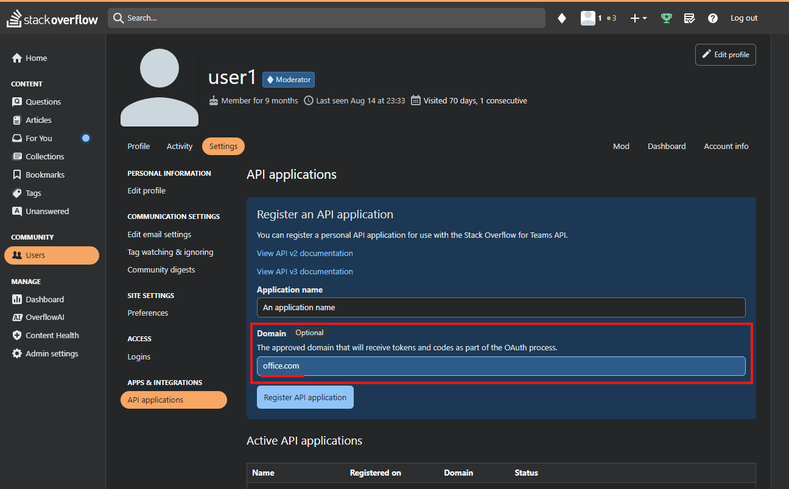

--- 
title: "Stack Overflow Microsoft 365 Copilot connector" 
ms.author: rerabo
author: vivg
manager: ereza
audience: Admin
ms.audience: Admin 
ms.topic: install-set-up-deploy
ms.service: copilot-connectors 
ms.localizationpriority: medium 
description: "Set up the Stack Overflow Microsoft 365 Copilot connector." 
ms.date: 12/25/2025
---

# Stack Overflow Microsoft 365 Copilot connector

The Stack Overflow Copilot connector allows your organization to index questions and answers from Stack Overflow. After you configure the connector, end users can search for these posts from Stack Overflow in Microsoft 365 Copilot and from any Microsoft Search client. 

## Capabilities
- Index Stack Overflow questions and answers.
- Allow your users to ask technical questions about your company's code and processes using Copilot. Examples:
   - What are the best practices for handling large datasets in our CRM software?
   - What are the differences between using REST and GraphQL for our API services?
   - How can we improve the load time of our customer-facing web applications?
- Use [Semantic search in Copilot](/microsoft-365-copilot/connectors/semantic-index-for-copilot) to enable users to find relevant content based on keywords, personal preferences, and social connections.
- The Stack Overflow Copilot connector supports Stack Overflow for Teams **Business** and **Enterprise**.

## Limitations
- The connector doesn't support [private teams](https://stackoverflowteams.help/articles/9736637-enable-and-set-up-private-teams) in Stack Overflow for Teams **Enterprise**.

## Prerequisites
- You must be an AI administrator for your organization's Microsoft 365 tenant.
- To create a new connection, use your organization's Stack Overflow Instance URL.
   - For Stack Overflow for Teams **Enterprise**, the instance URL is the home page URL, typically `https://<company_name>.stackenterprise.co`. 
   - For Stack Overflow for Teams **Business**, use the API URL, which usually looks like `https://api.stackoverflowteams.com/v3/teams/<company_name>`.
- For Stack Overflow for Teams **Enterprise**, when registering a new API application, set `office.com` as the approved domain (refer to the image below for a visual example).

     
## Get Started

### 1. Display name 
A display name is used to identify each citation in Copilot, helping users easily recognize the associated file or item. Display name also signifies trusted content. Display name is also used as a content source filter. A default value is present for this field, but you can customize it to a name that users in your organization recognize.

### 2. Stack Overflow URL
Use your organization's Stack Overflow Instance URL. For Stack Overflow for Teams **Enterprise**, this will be the home page URL, typically `https://<company_name>.stackenterprise.co`. For Stack Overflow for Teams **Business**, use the API URL, which usually looks like `https://api.stackoverflowteams.com/v3/teams/<company_name>`.

### 3. Authentication Type
To authenticate and sync content from Stack Overflow, choose one of the two supported methods: 
   - If you use Stack Overflow for Teams **Enterprise**, select OAuth. To learn more about authentication and authorization in Stack Overflow for Teams **Enterprise**, [click here](https://stackoverflowteams.help/articles/8043418-stack-overflow-for-teams-enterprise-api-v3#authentication-and-authorization). 
   - If you use Stack Overflow for Teams **Business**, select Basic authentication. To learn more about authentication and authorization in Stack Overflow for Teams **Business**, [click here](https://stackoverflowteams.help/articles/7913768-stack-overflow-for-teams-api-v3#authentication-and-authorization).
 
### 4. Roll out to limited audience
Deploy this connection to a limited user base if you want to validate it in Copilot and other Search surfaces before expanding the rollout to a broader audience. To know more about limited rollout, see [staged rollout](staged-rollout.md).

At this point, you're ready to create the connection for Stack Overflow. You can click on the "Create" button to publish your connection and index posts from your Stack Overflow account.

## Custom Setup

Custom setup is for admins who want to edit the default values for settings. Once you click on the 'Custom Setup' option, you see three other tabs: Users, Content, and Sync.

### Users

**Access Permissions**

Currently, questions and answers from your organization’s Stack Overflow instance are indexed. All the data indexed using the Stack Overflow Copilot connector is visible to all Microsoft 365 users in your tenant, accessible through Microsoft Search or Copilot.
 
### Content

**Manage properties**

Here, you can add or remove available properties from your Stack Overflow data source, assign a schema to the property (define whether a property is searchable, queryable, retrievable, or refinable), change the semantic label and add an alias to the property. Properties that are selected by default are listed below:

**Source Property** | **Semantic Label** |**Description**| **Schema**
--- | ---- | --- | ---
BestAnswerBody | | Best answer content (accepted by the question author as the most helpful or accurate) | Retrieve, Search
BestAnswerAuthorId |  | ID of the best answer | Retrieve
BestAnswerAuthorName | | Name of the author who provided the best answer | Retrieve, Search
BestAnswerCreatedAt | | Date when the best answer was created | Query, Refine, Retrieve
CreationDate | Created date time | Date when the post was created (question was asked) | Query, Refine, Retrieve
LastActivityDate | Last modified date time | Date when the post was last modified | Query, Refine, Retrieve
Link | URL | Link to the question in Stack Overflow | Retrieve, Search
OwnerDisplayName | Created by | Name of the post author | Query, Retrieve, Search
OwnerUserId | | ID of the person who posted the question | Retrieve
QuestionBody | | Question content | Query, Retrieve, Search
QuestionId | | ID of the question | Query, Retrieve
Score | | Score value of the question | Retrieve
Tags | | List of Tags that were added to a post | Query, Refine, Retrieve
Title | Title | Post title | Query, Retrieve, Search

### Sync

The refresh interval determines how often your data is synced between the data source and the Copilot connector index. There are two types of refresh intervals - full crawl and incremental crawl. For more information, see [refresh settings](deployment-overview.md#guidelines-for-crawl-settings).

## Troubleshooting
After publishing your connection, you can review the status in the **Connectors** section of the [admin center](https://admin.microsoft.com). To learn how to make updates and deletions, see [Manage your connector](manage-connector.md). 

If you have issues or want to provide feedback, contact [Microsoft Graph | Support](https://developer.microsoft.com/en-us/graph/support).
