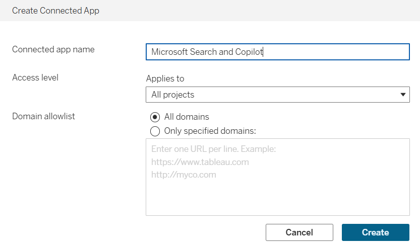
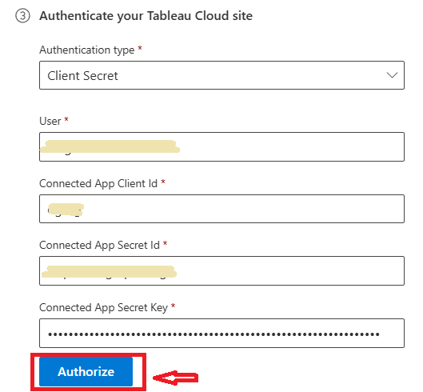

# Deploy the Tableau Cloud connector

The Tableau Cloud Microsoft 365 Copilot connector integrates Tableau Cloud items into Microsoft 365 experiences so users can discover and use published analytics content in Copilot, Copilot Search, and Microsoft Search. This article describes the steps to deploy and customize the Tableau Cloud connector.

## Prerequisites

Before you deploy the connector, make sure that you meet the following prerequisites:

- You must be an AI Administrator for your organization’s Microsoft 365 tenant.
- You must have Tableau Cloud site admin access.
- Your Tableau Cloud environment must be configured with a connected app that uses direct trust.
- You must have the required Tableau connected app values: client ID, app secret ID, and secret key.
  
### Considerations for Tableau Bridge and on-premises databases

If you use Tableau Bridge for live connections to local databases, evaluate your infrastructure capacity before you proceed. The connector’s periodic full crawls can generate a high volume of concurrent queries, which might overload the CPU and memory resources of your on-premises database. To mitigate this risk:

- Use selective ingestion: Index only essential projects or folders during setup instead of your entire Tableau instance.
- Adjust crawl frequency: Configure a longer interval for full crawls to reduce the continuous load on your local servers.

## Deploy the connector

To add the Tableau Cloud connector for your organization:
- In the Microsoft 365 admin center, in the left pane, select **Copilot** > **Connectors**.
- Select the **Gallery** tab.
- From the list of available connectors, select **Tableau Cloud**.

### Set display name

The display name identifies references in Copilot responses, so users can recognize the associated file or item. The display name also signifies trusted content and acts as a content source filter.

You can accept the default **Tableau Cloud** display name, or customize the value to use a display name that users in your organization recognize.

For more information about connector display names and descriptions, see [Enhance Copilot discovery of connector content](enhance-copilot-discovery.md).

### Set instance URL

Enter your Tableau Cloud site instance URL. The URL typically uses the following format:

`https://<your-domain>.online.tableau.com/#/site/<site-name>`

### Select authentication type

Use Tableau connected apps with direct trust to authenticate the connector.

To configure and use Direct Trust authentication:

1. Sign in to Tableau Cloud as a site admin.
2. Go to **Settings** > **Connected Apps**.
   
3. Select **New Connected App** > **Direct Trust**.
4. In the connected app form, provide the required settings:

| Field | Description | Recommended value |
|---|---|---|
| Connected app name | Unique value that identifies the app that requires Direct Trust. | Microsoft Search and Copilot |
| Access level | Controls which content can be embedded. | All projects (or Only one project, if required) |
| Domain allowlist | Domains where content can be embedded. | All domains |

5. Select **Create**, then enable the connected app.
 
6. On the connected app name, select **Actions**  > **Enable**.

7. On the connected app details page, select **Generate New Secret**.

8. Save the **Client ID**, **Secret ID**, and **Secret value**.
9. In the connector authentication pane in Microsoft 365 admin center, provide the required values:

| Field | Description |
|---|---|
| User | Admin user email. Use the admin account that configured Tableau connected apps with direct trust. |
| Connected app client ID | Client ID from the Tableau connected app. |
| Connected app secret ID | Secret ID from the Tableau connected app. |
| Connected app secret value | Secret value from the Tableau connected app. |

### Roll out

Roll out to a limited audience first if you want to validate the connector behavior in Copilot and Search before a broader rollout.

To roll out to a limited audience, select the toggle next to **Rollout to limited audience** and specify the users and groups to roll the connector out to. For more information, see [Staged rollout for Microsoft 365 Copilot connectors](staged-rollout.md).

Select **Create** to deploy the connection. The Tableau Cloud connector starts indexing content right away.

The following table lists the default values that are set.

| Category | Default value |
|----------|---------------|
| Users | Access permissions: Only people with access to this data source. Identity mapping: Data source identities mapped using Microsoft Entra IDs. |
| Content | All sheets except sheets in personal space. |
| Sync | Incremental crawl every 15 minutes. Full crawl every day. |

To customize these values, select **Custom setup**. For more information, see [Customize settings](#customize-settings-optional).

After you create your connection, you can review the status in the **Connectors** section of the [Microsoft 365 admin center](https://admin.microsoft.com/).

## Customize settings (optional)

You can customize the default values for the Tableau Cloud connector settings. To customize settings, on the connector page in the admin center, select **Custom setup**.

### Customize user settings

#### Access permissions

The Tableau Cloud connector supports these access options:

- **Only people with access to this data source** (recommended)
- **Everyone**

If you select **Everyone**, indexed data appears in search results for all users.

When you use **Only people with access to this data source**, the connector applies permission evaluation logic similar to Tableau ACL behavior so content isn't overshared with users who don’t have the appropriate permissions within Tableau Cloud sites.

#### Map identities

When you use **Only people with access to this data source**, select the identity type that matches your tenant:

- **Microsoft Entra ID**: Use this option when Tableau user email addresses match Microsoft Entra user principal names (UPN).
- **Non-AAD**: Use this option when Tableau user email addresses don't match Microsoft Entra UPN values. Configure regex-based identity mapping for this case.

Updates to users or groups that govern access permissions sync during full crawls only.

### Customize content settings

#### Query string

By default, the connector indexes all published Tableau Cloud sheets in supported project scopes, excluding sheets in personal space. Use content ingestion filters to narrow the indexed content.

#### Manage properties

Review and configure indexed properties, including schema attributes, semantic labels, and aliases.

| Property | Semantic label | Description | Schema attributes |
|---|---|---|---|
| createdAt | created date time | Timestamp when the sheet was created. | Query, Retrieve |
| iconUrl | iconUrl | Icon URL for worksheet, dashboard, or story item types. | Retrieve |
| itemPath | itemPath | Hierarchical project path of the Tableau item. | Query, Retrieve, Search |
| lastModifiedBy | last modified by | User who last modified the sheet. | Query, Retrieve, Search |
| name | Title | Display name of the sheet. | Query, Retrieve, Search |
| projectName | none | Parent project name for the sheet. | Query, Search |
| sheetType | itemType | Sheet type, such as worksheet, dashboard, or story. | Query, Refine, Retrieve |
| sheetUrl | URL | Direct link to the sheet in Tableau. | Retrieve |
| tags | Tags | Tags assigned to the sheet. | Query, Refine, Retrieve |
| updatedAt | last modified date time | Timestamp of the most recent change. | Query, Retrieve |
| workbookName | containerName | Workbook that contains the sheet. | Query, Retrieve, Search |
| workbookUrl | containerUrl | URL of the workbook that contains the sheet. | Retrieve |

### Customize sync intervals

You can configure full and incremental crawls based on scheduling options. The default values are:

- Full crawl - Every day.
- Incremental crawl - Every 15 minutes.

By default, incremental crawl runs every 15 minutes and full crawl runs every day.

Adjust these schedules to fit your data refresh needs. For more information, see [Guidelines for sync settings](deployment-overview.md#guidelines-for-crawl-settings).

## Related content

- [Tableau Cloud connector overview](tableau-cloud-overview.md)
- [Troubleshoot issues with the Tableau Cloud connector](tableau-cloud-troubleshooting.md)
- [Set up Copilot connectors in the Microsoft 365 admin center](deployment-overview.md)
