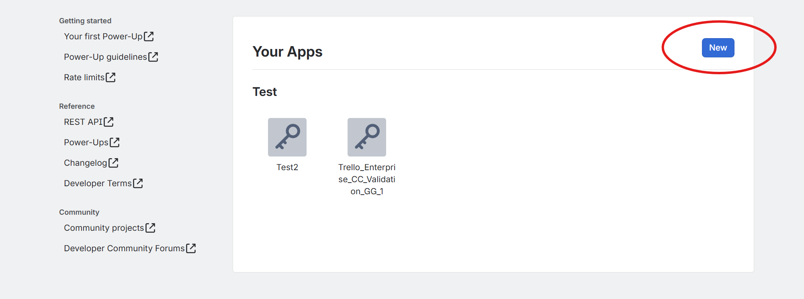
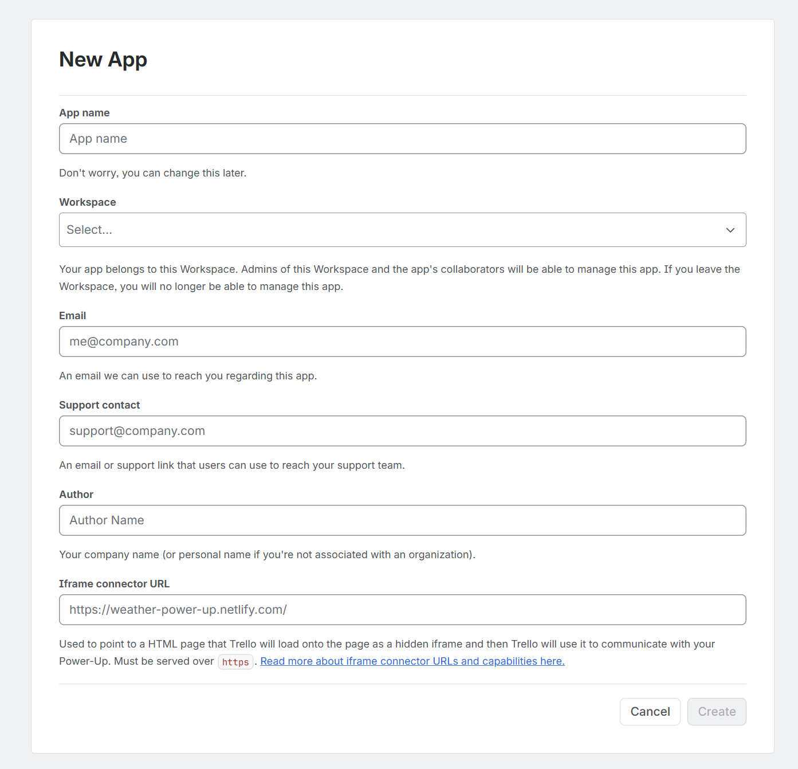
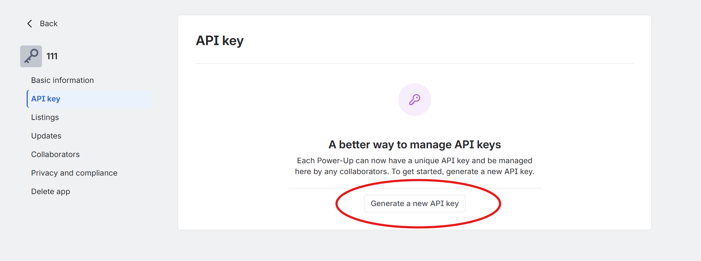
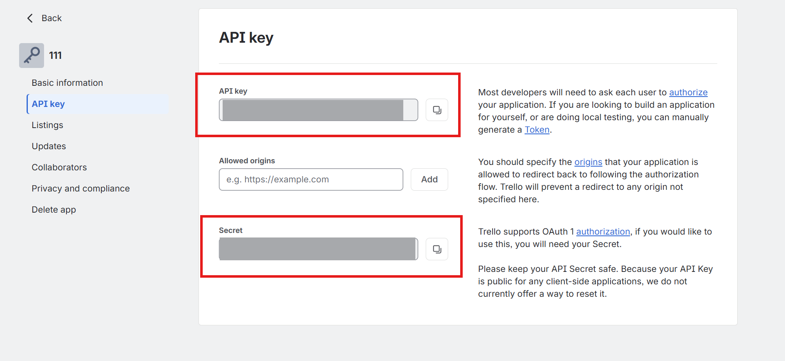

<!-- markdownlint-disable-next-line MD025 -->
# Deploy the Trello connector

The Trello Microsoft 365 Copilot connector enables your organization to index Trello cards so users can discover, access, and use Trello content directly within Microsoft 365 experiences. This article describes the steps to deploy and customize the Trello connector.

## Prerequisites

Before you deploy the connector, make sure that you meet the following prerequisites:

- You're a Microsoft 365 administrator.
- Your organization has the Trello Enterprise plan.
- You have a Trello developer account.

## Configure Trello app

To configure a Trello app:

- Go to [https://trello.com/power-ups/admin](https://trello.com/power-ups/admin).
- Select **New** to add a new app.

  

- Fill in the required fields to create a new app.

  

   

## Get the API key and secret

- Select **Generate a new API key**.

   

- Copy the API key and secret from the app for authentication in Microsoft 365 admin center.

   

## Deploy the connector

To add the connector for your organization:

- In the Microsoft 365 admin center, in the left pane, choose **Copilot** > **Connectors**.
- Choose the **Gallery** tab.
- From the list of available connectors, choose **Trello**.

### Set display name

The display name identifies references in Copilot responses to help users recognize the associated file or item. The display name also signifies trusted content and is used as a content source filter.

You can accept the default display name, or customize the value to use a display name that users in your organization recognize.

### Choose authentication type

The Trello connector supports the following authentication option:

- **Trello OAuth**: Enter the consumer key and private secret from your Trello app registration.

### Roll out

To roll out to a limited audience, select the toggle next to **Rollout to limited audience** and specify the users and groups to roll the connector out to.

Select **Create** to deploy the connection. The Copilot connector starts indexing content right away.

The following table lists the default values that are set.

| Category | Default value |
| --- | --- |
| Users | Default access permission is set to be visible to everyone |
| Content | Manage properties are set to default schema values |
| Sync | Incremental crawl every 15 minutes; full crawl every day |

To customize these values, select **Custom setup**.

After you create your connection, you can review the status in the **Connectors** section of the Microsoft 365 admin center.

## Customize settings (optional)

You can customize the default values for the connector settings. To customize settings, on the connector page in the admin center, select **Custom setup**.

### Customize user settings

#### Access permissions

The Trello connector supports search permissions that are visible to **Everyone** or **Only people with access to this data source**.

#### Map identities

The default method for mapping your data source identities with Microsoft Entra ID checks whether the email address of Trello users matches the user principal name (UPN) or email of users in Microsoft Entra ID. If the default mapping doesn't work for your organization, provide a custom mapping formula.

### Customize content settings

#### Manage properties

The following table lists the properties that are selected by default.

| Property | Semantic Label | Description | Schema Attributes |
| --- | --- | --- | --- |
| Id | | Unique identifier of the Trello card | Query, Retrieve |
| Description | | Description content of the Trello card | Search |
| Due | DueDate | Due date of the item | Query, Retrieve |
| LabelName | tags | Tags or labels associated with the item | Search, Query, Retrieve |
| Name | title | The title of the item | Search, Query, Retrieve |
| Start | createdDateTime | Start date of the card | Query, Retrieve |
| Url | url | The target URL of the item in the data source | Search, Query, Retrieve |
| Members | assignedToPeople | People assigned to the item | Search, Query, Retrieve |

### Customize sync intervals

The refresh interval determines how often your data syncs between the data source and the Trello Copilot connector index. The default values are:

- Incremental crawl: Every 15 minutes.
- Full crawl: Every day.

For more information, see [Guidelines for sync settings](deployment-overview.md#guidelines-for-crawl-settings).

## Related content

- [Trello connector overview](trello-overview.md)
- [Troubleshoot issues with the Trello connector](trello-troubleshooting.md)
